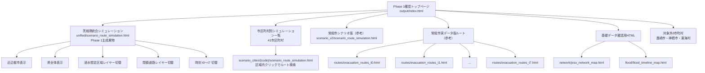

# Phase 1 HTML画面遷移図

> 作成日：2026/05/01
> 最終確認：2026/05/11
> 対象：Phase 1 成果物HTMLの確認用トップページと統合シミュレーション
> 目的：卒論・発表で確認するHTML成果物の主従関係と画面遷移を明確にする

---

## 1. 現在の固定方針

Phase 1 のHTML成果物は、`04_プログラム/output/index.html` を入口とし、茨城県統合シミュレーションを主成果物として扱う。

常総市実データ版、常総市シナリオ版、道路ネットワーク図、浸水時系列図は、主成果物を説明するための参考成果物として扱う。

| 種別 | パス | 本文での扱い |
|------|------|------|
| Phase 1確認トップページ | `04_プログラム/output/index.html` | 成果物全体の入口 |
| 茨城県統合シミュレーション | `04_プログラム/output/unified/scenario_route_simulation.html` | Phase 1 の主成果物 |
| 市区町村別シミュレーション | `04_プログラム/output/scenario_cities/{code}/scenario_route_simulation.html` | 41市区町村の個別確認 |
| 常総市シナリオ版 | `04_プログラム/output/scenario_v2/scenario_route_simulation.html` | シナリオ生成ルールの代表例 |
| 常総市実データ版ルート | `04_プログラム/output/routes/evacuation_routes_t0.html`〜`t7.html` | 実データ版の参考成果物 |
| 道路・浸水確認図 | `04_プログラム/output/network/`、`04_プログラム/output/flood/` | 基礎データ確認用 |

---

## 2. 対象HTMLファイル

| 区分 | ファイル | 内容 |
|------|----------|------|
| トップページ | `output/index.html` | Phase 1成果物の入口。統合版、市別版、参考版へ遷移 |
| 統合版 | `output/unified/scenario_route_simulation.html` | 近辺都市/県全体の表示範囲切替、浸水想定区域/閉鎖道路の表示切替 |
| 市区町村別版 | `output/scenario_cities/{code}/scenario_route_simulation.html` | 41市区町村の区域内クリックによる避難ルート検索 |
| 常総市シナリオ版 | `output/scenario_v2/scenario_route_simulation.html` | 常総市における段階的浸水拡大と任意地点ルート検索 |
| 常総市実データ版 | `output/routes/evacuation_routes_t0.html`〜`t7.html` | 実データに基づく時刻別ルート可視化 |
| 道路ネットワーク | `output/network/joso_network_map.html` | 常総市道路ネットワークの確認 |
| 浸水時系列 | `output/flood/flood_timeline_map.html` | 常総市実データ版の浸水範囲確認 |

---

## 3. 画面遷移図

**図1 Phase 1 HTML成果物の画面遷移**

---

## 4. 確認済み内容

| 確認項目 | 結果 |
|----------|------|
| `output/index.html` | 存在を確認 |
| `output/unified/scenario_route_simulation.html` | 存在を確認 |
| `output/scenario_v2/scenario_route_simulation.html` | 存在を確認 |
| `output/routes/evacuation_routes_t0.html`〜`t7.html` | t0・t7の存在を確認 |
| `output/scenario_cities/` | 40ディレクトリを確認 |
| `output/assets/phase1-pages.js` | 市区町村リンク41件、対象外3件を確認 |

---

## 5. 卒論での使い方

卒論本文では、まず `index.html` を成果物入口として示し、次に統合シミュレーションを主成果物として説明する。

市区町村別ページは、統合シミュレーションで全体像を確認した後、個別自治体の区域内ルート検索を確認する補助資料として扱う。常総市シナリオ版はシナリオ生成ルールを説明する代表例、常総市実データ版は処理パイプラインの成立を示す参考成果物として扱う。
