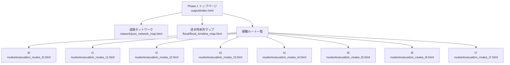

# Phase 1 HTML画面遷移図

> 作成日：2026/05/01  
> 対象：Phase 1 成果物HTMLの確認用トップページ  
> 目的：Google Chromeで確認する複数のHTML成果物を、1つのトップページから遷移できる構造に整理する

---

## 1. 方針

Phase 1 の成果物として生成済みのHTMLファイルを、確認用トップページから選択して開けるようにする。

トップページは以下のパスに作成する想定とする。

| 種別 | 想定パス | 役割 |
|------|----------|------|
| トップページ | `04_プログラム/output/index.html` | Phase 1 成果物HTMLへの入口 |

---

## 2. 対象HTMLファイル

| 区分 | ファイル | 内容 |
|------|----------|------|
| 道路ネットワーク | `output/network/joso_network_map.html` | 常総市の道路ネットワーク |
| 浸水時系列 | `output/flood/flood_timeline_map.html` | 8時点の浸水範囲 |
| 避難ルート t0 | `output/routes/evacuation_routes_t0.html` | 2015-09-10T18:00:00 の避難ルート |
| 避難ルート t1 | `output/routes/evacuation_routes_t1.html` | 2015-09-11T06:00:00 の避難ルート |
| 避難ルート t2 | `output/routes/evacuation_routes_t2.html` | 2015-09-11T18:00:00 の避難ルート |
| 避難ルート t3 | `output/routes/evacuation_routes_t3.html` | 2015-09-12T06:00:00 の避難ルート |
| 避難ルート t4 | `output/routes/evacuation_routes_t4.html` | 2015-09-12T18:00:00 の避難ルート |
| 避難ルート t5 | `output/routes/evacuation_routes_t5.html` | 2015-09-13T06:00:00 の避難ルート |
| 避難ルート t6 | `output/routes/evacuation_routes_t6.html` | 2015-09-13T18:00:00 の避難ルート |
| 避難ルート t7 | `output/routes/evacuation_routes_t7.html` | 2015-09-16T10:20:00 の避難ルート |

---

## 3. 画面遷移図

---

## 4. トップページの構成案

トップページは、以下の3区分でリンクを配置する。

| セクション | 表示内容 | 遷移先 |
|------------|----------|--------|
| 道路ネットワーク | 常総市道路NWの確認 | `network/joso_network_map.html` |
| 浸水時系列 | 浸水範囲の時間変化確認 | `flood/flood_timeline_map.html` |
| 避難ルート | t0〜t7の避難ルート確認 | `routes/evacuation_routes_t0.html`〜`t7.html` |

---

## 5. 実装時の注意

- トップページは `output/` 直下に置き、既存HTMLへの相対リンクで遷移する。
- 既存の `network/`、`flood/`、`routes/` 配下のHTMLファイル名は変更しない。
- Phase 1 の成果確認用ページであり、シミュレーション処理や出力データの生成ロジックは変更しない。
- 後続でHTML生成コードを修正する場合も、まず `output/index.html` を追加する範囲に留める。

