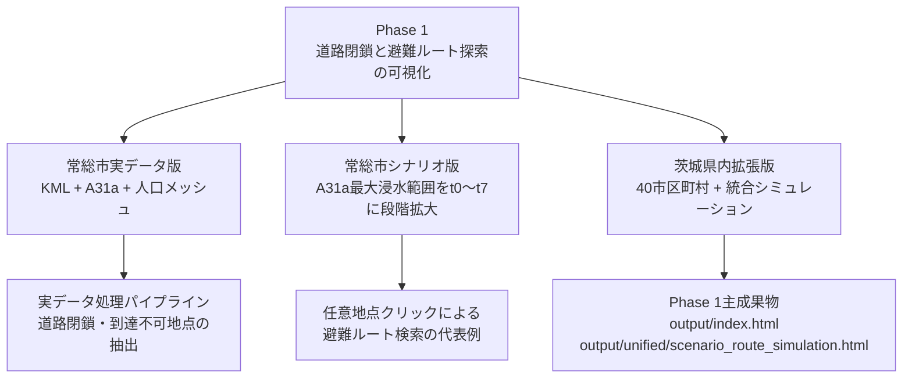
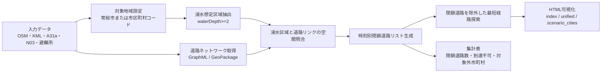

# Phase 1 本文ドラフト

> 作成日：2026/05/08
> 精査日：2026/05/09
> 位置づけ：卒業論文本文へ転記・調整するための Phase 1 章ドラフト
> 対象：使用データ、処理フロー、シナリオ生成ルール、結果と考察、限界と今後の課題

---

## 1. Phase 1 の位置づけ

本研究では、河川氾濫時における自家用車避難とデマンド交通バス活用の比較を最終的な研究構想としている。しかし、交通流シミュレーション、車両エージェント、配車制御、バス運行を同時に実装すると作業量が大きくなる。そのため、本研究では段階的に研究を進め、Phase 1 では卒業論文として成立する最低条件として、浸水進行に伴う道路閉鎖と避難ルート探索の可視化を行う。

本研究でこのシステムを作成する根拠は、2015年9月の平成27年9月関東・東北豪雨に伴う鬼怒川氾濫である。特に、茨城県常総市では鬼怒川左岸の堤防決壊と溢水により広範囲の浸水被害が発生し、避難の遅れや救助活動が大きな課題となった。栃木県日光市は上流域の記録的降雨を説明するうえで重要であるが、Phase 1 の避難経路検索対象ではなく、水文学的背景として扱う。災害背景、直接被害を受けた地域、鬼怒川下流域の対策対象市町、広域避難計画上の対象市町、日光市を対象外とする理由は、`03_研究設計文書/論文用説明_Phase1_災害背景と対象地域.md` に整理した。

Phase 1 の目的は、洪水浸水想定区域、道路ネットワーク、避難所データを統合し、時刻ごとの浸水範囲に応じて通行困難な道路を閉鎖したうえで、出発地点から到達可能な避難所への経路を検索できる仕組みを構築することである。これにより、浸水が拡大した場合に避難経路がどのように変化するか、また一部地点で避難所へ到達しにくくなる状況が発生するかを確認する。

本章で扱う Phase 1 は、交通流シミュレーションではなく、道路閉鎖を考慮した静的な経路探索である。したがって、渋滞、車両同士の相互作用、信号制御、道路容量、避難開始時刻のばらつきは扱わない。本段階の成果は、後続の Phase 2 以降で交通流やデマンド交通バスを扱うための基礎となる。

---

## 2. 使用データ

Phase 1 では、実際の災害・地理条件に基づく分析とするため、国・自治体・オープンデータ由来のデータを組み合わせて用いた。主なデータと用途を表1に示す。

**表1 使用データ一覧**

| データ | 主な用途 | 使用理由 |
|---|---|---|
| OpenStreetMap 道路ネットワーク | 避難経路探索の道路グラフ作成 | 道路リンク・ノード構造を取得でき、NetworkX による経路探索に利用できるため |
| 国土地理院 KML D1-No.917 | 2015年鬼怒川氾濫の実浸水時系列の参照 | 実災害時の浸水範囲変化を確認する根拠資料として利用するため |
| 国土数値情報 A31a 洪水浸水想定区域 | 浸水深0.5m以上の抽出、道路閉鎖判定 | 浸水深属性を持ち、道路通行困難の条件設定に利用できるため |
| A31a その他河川データ | 茨城県内の対象市町村拡張 | 鬼怒川系以外の浸水想定区域も扱うため |
| N03 行政区域 | 市区町村単位の対象範囲設定 | 対象市町村ごとの浸水範囲・道路ネットワーク抽出に利用するため |
| 国土数値情報 P20 避難施設データ（Shapefile） | 常総市実データ版の洪水対応避難所19件の抽出 | 洪水対応フラグ付きで常総市内19件を特定できるため |
| GSI 指定緊急避難場所 CSV（2026年版） | 茨城県内拡張版の市区町村別洪水対応避難所の抽出 | 洪水対応フラグ付きで市区町村ごとの避難所を一括取得できるため |
| 250m メッシュ人口 | 実データ版の人口メッシュ出発地設定 | 常総市実データ版で浸水域内人口を把握するため |
| 車両保有台数統計 | Phase 2 以降の車両エージェント設定準備 | 自家用車避難シミュレーションへ接続するため |
| 浸水ナビハイドログラフ | 破堤点・時系列条件の補助確認 | シナリオ生成時の基準点・時刻設定の補助資料として利用するため |

道路閉鎖の判定では、A31a の `waterDepth` 属性を用い、コード値2以上、すなわち浸水深0.5m以上を通行困難条件とした。これは、自動車避難において一定以上の浸水深では走行が困難になるという前提に基づく。

---

## 3. 処理フロー

Phase 1 の処理は、常総市実データ版、常総市シナリオ版、茨城県内拡張版の三層で整理する。

経路検索方法の詳細は、論文用説明資料 `03_研究設計文書/論文用説明_Phase1_経路検索方法.md` に整理した。本節では処理全体の流れを示し、経路探索のアルゴリズム、出発地・目的地の扱い、到達不可判定の詳細は同資料を参照する。

常総市実データ版では、2015年鬼怒川氾濫の時系列データと洪水浸水想定区域を用いて、道路閉鎖リストと避難ルートを生成する。これは、データ取得、空間照合、道路閉鎖、経路探索までの基本処理が成立することを確認する基礎パイプラインである。

常総市シナリオ版では、実データ版だけでは時系列変化が研究成果として見えにくい課題を補うため、A31a に基づく最大浸水範囲を t0 から t7 にかけて段階的に拡大する。これにより、浸水進行に伴う道路閉鎖と避難経路変化を確認する。

茨城県内拡張版では、市区町村単位で同じ処理を適用し、県内40市区町村でシナリオ成果物を確認できるようにする。さらに、統合シミュレーションでは、近辺都市表示と県全体表示を切り替えながら、浸水想定区域と閉鎖道路を時刻別に確認できるようにする。

**図1 Phase 1 の成果物構成**

**表2 Phase 1 の処理フロー**

| 手順 | 処理内容 | 主な出力 |
|---|---|---|
| 1 | 対象市区町村を設定する | 市区町村コード、行政区域 |
| 2 | OpenStreetMap から道路ネットワークを取得する | GraphML、道路エッジ GeoPackage |
| 3 | A31a 浸水想定区域を読み込む | 浸水深付きポリゴン |
| 4 | 浸水深0.5m以上の範囲を抽出する | 道路閉鎖判定用ポリゴン |
| 5 | 浸水ポリゴンと道路リンクを空間照合する | 閉鎖対象エッジ |
| 6 | t0〜t7 の時刻別閉鎖リストを生成する | `road_closure_timeline`、時刻別閉鎖道路 |
| 7 | 閉鎖道路を避けて避難所までの最短経路を探索する | 避難ルート、到達不可判定 |
| 8 | HTML 上で浸水範囲・閉鎖道路・避難ルートを可視化する | 常総市版、市別版、統合版HTML |

**図2 Phase 1 の処理フロー**

---

## 4. シナリオ生成ルール

実データ版の検証では、KML と A31a を組み合わせて道路閉鎖を生成した。最新の実データ版では、A31a の常総市境界クリップと `kml_a31a` 方式により、累積閉鎖エッジ数は t0 の168本から t1 以降の764本へ増加することを確認した。一方で、人口メッシュを出発地とする実データ版では、出発地点が40メッシュに限定されるため、地図上で任意地点の避難可能性を確認する用途には向かない。

そこで Phase 1 シナリオ版では、実データを根拠としつつ、最終浸水範囲を t0〜t7 に段階的に拡大するシナリオを作成した。これは実災害の完全再現ではなく、浸水進行に伴う道路閉鎖と避難経路変化を確認するための検証用シナリオである。

**表3 常総市シナリオ版の生成ルール**

| 項目 | ルール |
|---|---|
| 最大浸水範囲 | A31a 国管理河川 `08_10` の `waterDepth >= 2` |
| 対象地域 | N03 行政区域で常総市にクリップ |
| 基準点 | BP030 近傍の破堤点 |
| 破堤時刻 | 2015年9月10日 12時50分 |
| 拡大方法 | 破堤点から各浸水ポリゴン重心までの距離順に累積拡大 |
| 時間配分 | 破堤後の経過時間比率を距離分位点に対応させる |
| 道路閉鎖条件 | 各時点の浸水範囲と道路リンクが交差した場合に閉鎖 |
| ルート検索 | 任意地点から到達可能な最寄り洪水対応避難所への最短経路を探索 |

**表4 常総市シナリオ版の時点別変化**

| 時点 | 時刻 | 経過時間比率 | 採用ポリゴン数 | 閉鎖エッジ数 |
|---|---|---:|---:|---:|
| t0 | 2015-09-10 18:00 | 3.7% | 11 | 12 |
| t1 | 2015-09-11 06:00 | 12.2% | 36 | 12 |
| t2 | 2015-09-11 18:00 | 20.6% | 60 | 15 |
| t3 | 2015-09-12 06:00 | 29.1% | 85 | 15 |
| t4 | 2015-09-12 18:00 | 37.6% | 109 | 18 |
| t5 | 2015-09-13 06:00 | 46.1% | 134 | 18 |
| t6 | 2015-09-13 18:00 | 54.6% | 158 | 20 |
| t7 | 2015-09-16 10:20 | 100.0% | 290 | 33 |

茨城県内拡張版では、この考え方を市区町村単位へ拡張し、A31a `08_10` および `08_20`、N03 行政区域、GSI 指定緊急避難場所を用いて、対象市区町村ごとに浸水範囲、閉鎖道路、避難所を生成する。トップページ上では40市区町村のシナリオ成果物を確認できる。

---

## 5. 結果

### 5.1 常総市実データ版

常総市実データ版では、OSMnx により道路ネットワークを取得し、KML と A31a を組み合わせて8時点の浸水ポリゴンを作成した。浸水範囲と道路リンクを空間照合し、時刻別の道路封鎖リストを生成したうえで、人口メッシュ重心から洪水対応避難所までの避難ルートを探索した。

実データ版の主な結果を表5に示す。

**表5 常総市実データ版の主な結果**

| 指標 | 値 |
|---|---:|
| 道路エッジ数 | 12,860 |
| 出発地メッシュ数 | 40 |
| 出発地総人口 | 2,257 |
| 出発地高齢者数 | 611 |
| 洪水対応避難所数 | 19 |
| 累積閉鎖エッジ数 | 168本から764本へ増加 |
| 到達不可メッシュ数 | 各時点17 |
| 到達不可人口 | 各時点952 |
| 到達不可高齢者数 | 各時点223 |
| ルートHTML | 8ファイル |

実データ版では、累積閉鎖エッジ数の増加は確認できた。一方で、到達不可メッシュ数は各時点で同じ値となった。これは、対象とした出発地メッシュと避難所配置の関係上、t0 時点で到達できない地点が後続時点でも継続して到達不可となるためである。したがって、実データ版は、実データ処理パイプラインと到達不可地点の抽出結果として位置づける。

### 5.2 常総市シナリオ版

常総市シナリオ版では、最終浸水範囲を破堤点からの距離に応じて段階的に拡大し、地図上で指定した任意地点から避難所までのルートを探索できるようにした。これにより、人口メッシュ重心に限定されない地点から避難可能性を確認できるようになった。

シナリオ版では、閉鎖エッジ数が t0 の12本から t7 の33本へ増加し、浸水進行に伴う道路閉鎖の増加を可視化できた。また、時刻を切り替えることで、同じ出発地点であっても閉鎖道路の増加により避難経路が変化することを確認できる。

### 5.3 茨城県内拡張版

茨城県内拡張版では、常総市固定の実装を市区町村単位へ拡張し、トップページ上で40市区町村のシナリオ成果物を確認できるようにした。市区町村別ページでは、対象市区町村ごとに浸水想定区域、閉鎖道路、洪水対応避難所、任意地点からの避難ルートを確認できる。

統合シミュレーションでは、県全体地図上で「近辺都市」と「県全体」の表示範囲を切り替えられるようにした。また、浸水想定区域と閉鎖道路を個別に表示切替できるようにし、茨城県内の浸水想定区域と道路閉鎖の広がりを時刻別に確認できるようにした。

現時点で対象外として整理した市町村は、鹿嶋市、神栖市、東海村、五霞町の4市町村である。これらは、A31a浸水想定区域が市町村境界内に存在しない、または対象河川データに未収録であるため、Phase 1 のシナリオ生成対象外とした。

対象外4市町村の除外理由は、`06_研究結果/phase1/Phase1_対象外市町村の除外原因分析.md` に整理した。除外理由はすべて同じではなく、地形的理由で対象外とみなせる自治体と、データ制約により分析対象から外れた自治体を区別する必要がある。

**表6 対象外4市町村の除外理由**

| 市区町村 | 主な除外理由 | 論文での扱い |
|---|---|---|
| 東海村 | 那珂川・久慈川の浸水想定区域が村域内に到達しない | 地形的理由による対象外として説明 |
| 鹿嶋市 | 沿岸・汽水域であり、河川洪水想定区域が市域内に存在しない | 河川洪水シミュレーションの対象外として説明 |
| 神栖市 | 利根川河口部・沿岸部であり、利根川系データが本研究データセットに未収録 | 地理的理由とデータ制約の両方として説明 |
| 五霞町 | 利根川・渡良瀬川合流部の高リスク地域だが、利根川系A31aが茨城県版に未収録 | データ制約による重要な限界として明記 |

---

## 6. 考察

詳細な卒論向け考察は、`03_研究設計文書/論文用説明_Phase1_考察.md` に整理した。本節では、本文へ転記する際の要点を示す。

Phase 1 の成果により、浸水想定区域と道路ネットワークを重ね合わせることで、時刻ごとの道路閉鎖と避難ルートの変化を可視化できることが確認された。特に、シナリオ版では、浸水範囲の段階的拡大に応じて閉鎖道路数が増加し、任意地点からの避難ルートが変化する様子を確認できた。

実データ版では、実災害に近い時系列データを用いることで、実際のデータ処理に基づく道路閉鎖リストと到達不可地点を得ることができた。一方で、到達不可数の時系列変化は限定的であった。これに対し、シナリオ版は、浸水進行に伴う経路変化を説明するための補助的な検証成果として有効である。

また、茨城県内拡張版では、単一市町村に限定せず、複数市町村で同一の処理を適用できることを確認した。市区町村別シナリオでは、閉鎖道路の絶対数が多い地域として水戸市、筑西市、つくば市、取手市、常総市が確認された。一方で、道路網全体に対する閉鎖率では、河内町、大子町、城里町などが高い値を示した。このことから、避難経路への影響は、都市部では広範囲の道路閉鎖として現れ、小規模自治体では道路網に占める閉鎖割合の高さとして現れる可能性がある。

浸水想定区域と道路閉鎖の関係については、浸水範囲が広がるほど閉鎖道路数は増加する傾向が見られた。ただし、浸水範囲の拡大と閉鎖道路数は完全には比例しない。追加された浸水ポリゴンが道路リンクと交差しない場合や、すでに閉鎖された道路周辺に浸水範囲が広がる場合には、新たな閉鎖道路数は増えにくい。したがって、避難経路への影響を評価するには、浸水範囲の広さだけでなく、浸水想定区域が道路ネットワークのどの部分を横切るかを確認する必要がある。

統合シミュレーションにより、県全体の浸水想定区域と閉鎖道路を俯瞰しつつ、必要に応じて近辺都市や市区町村別ページへ移動して詳細確認できる構成になった。これは、地域全体のリスク把握と個別地点の避難経路確認をつなぐ点で有効である。

ただし、本段階の結果は交通流シミュレーションではない。最短経路が存在するかどうかを中心に評価しており、避難者が同時に移動することで発生する渋滞、車両同士の相互作用、信号、道路容量、移動速度の低下は考慮していない。そのため、Phase 1 の結果は「避難可能性の構造確認」および「道路閉鎖に伴う経路変化の可視化」として解釈する必要がある。

---

## 7. Phase 1 成果物の固定

Phase 1 の成果物は、以下の優先順位で固定する。

**表7 Phase 1 成果物の固定方針**

| 優先 | 成果物 | パス | 本文での扱い |
|---:|---|---|---|
| 1 | Phase 1 確認トップページ | `04_プログラム/output/index.html` | Phase 1 成果物の入口 |
| 2 | 茨城県統合シミュレーション | `04_プログラム/output/unified/scenario_route_simulation.html` | 主成果物。近辺都市/県全体、浸水想定区域/閉鎖道路を切替表示 |
| 3 | 市区町村別シミュレーション | `04_プログラム/output/scenario_cities/{code}/scenario_route_simulation.html` | 40市区町村の個別確認用成果物 |
| 4 | 常総市シナリオ版 | `04_プログラム/output/scenario_v2/scenario_route_simulation.html` | シナリオ生成ルールの代表例 |
| 5 | 常総市実データ版ルート | `04_プログラム/output/routes/evacuation_routes_t0.html`〜`t7.html` | 実データ版の参考成果物 |
| 6 | 道路・浸水地図 | `04_プログラム/output/network/`、`04_プログラム/output/flood/` | 基礎データ確認用成果物 |

本文では、`index.html` を成果物確認の入口とし、茨城県統合シミュレーションを Phase 1 の主成果物として扱う。常総市単独シミュレーションと実データ版ルートHTMLは、主成果物を支える参考成果物として扱う。

---

## 8. 限界と今後の課題

Phase 1 には以下の限界がある。

第一に、交通流を扱っていない点である。Phase 1 では道路閉鎖を考慮した最短経路探索を行うが、交通量、車両密度、渋滞、避難開始時刻のばらつきは扱っていない。そのため、経路が存在する場合でも、実際に避難完了できるとは限らない。

第二に、シナリオ版の浸水拡大は実測時系列の完全再現ではない点である。シナリオ版では、最終浸水範囲を破堤点からの距離に応じて段階的に拡大している。これは避難ルート探索機能を検証するための設定であり、実際の浸水到達時刻や地形・排水条件を厳密に再現したものではない。

第三に、避難者の意思決定を考慮していない点である。実際の避難では、避難開始判断、避難先選択、家族構成、車両保有、道路混雑の認知などが影響するが、Phase 1 ではこれらを明示的にはモデル化していない。

第四に、対象外市町村が残っている点である。A31a浸水想定区域が市町村境界内に存在しない、または対象河川データに未収録の市町村は、Phase 1 の市区町村別シナリオ生成対象外とした。東海村と鹿嶋市は地形・災害種別の観点から河川洪水シミュレーションの対象外として説明できる。一方で、神栖市と五霞町は利根川系データの未収録が関係しており、特に五霞町は利根川・渡良瀬川合流部に位置する高洪水リスク地域であるため、対象外であることを研究の限界として明記する必要がある。今後対象地域をさらに広げる場合は、利根川水系の浸水想定区域、高潮・津波等の別災害種別、または自治体独自データの利用可能性を確認する必要がある。

今後の課題として、Phase 2 では SUMO と TraCI を用いて車両エージェントを道路ネットワーク上で走行させ、動的な道路閉鎖と渋滞を考慮した避難可能性を分析する必要がある。さらに Phase 3 では、デマンド交通バスを導入した場合と自家用車避難のみの場合を比較し、高齢者や車両非保有者の避難支援効果を評価することが課題となる。

---

## 9. 本文へ転記する際の注意

- 「実災害を完全再現した」とは書かず、「実データを根拠にしたシナリオ」と表現する。
- Phase 1 の成果は、交通流ではなく道路閉鎖と経路探索の可視化であると明記する。
- 常総市実データ版、常総市シナリオ版、茨城県内拡張版を混同しない。
- 成果物は `output/index.html` を入口、茨城県統合シミュレーションを主成果物として扱う。
- 市区町村数や対象外市町村は、最終提出前に `output/index.html` と `phase1-pages.js` で再確認する。
- 図表の一覧と確認状況は `03_研究設計文書/Phase1_図表一覧.md` を参照する。
- 画面遷移図は `03_研究設計文書/Phase1_HTML画面遷移図.md` の最終版を使用する。
