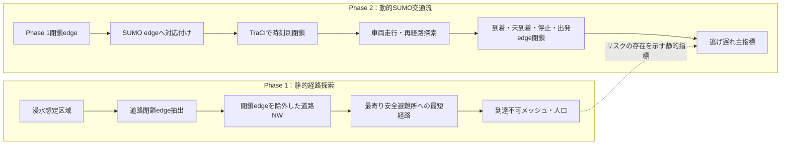

# Phase 1静的分析とPhase 2動的分析の比較概念図

> 作成日：2026/05/19  
> 目的：Phase 1の到達不可とPhase 2の逃げ遅れ主指標を同一指標として誤読しないよう、分析単位と処理の違いを整理する。

---

## 1. 比較概念図

---

## 2. 指標の違い

| 項目 | Phase 1 | Phase 2 |
|---|---|---|
| 分析単位 | メッシュ・人口 | 車両 |
| 主な問い | 閉鎖道路を除いたとき避難所へ到達できるか | 動的閉鎖下で車両が避難完了できるか |
| 主指標 | 到達不可メッシュ数、到達不可人口 | 未到着台数、逃げ遅れ主指標、平均速度、停止台数 |
| 時間の扱い | 時点別の閉鎖道路を静的に評価 | SUMO時刻上で道路閉鎖と車両走行を同時に進める |
| 比較時の注意 | 人口・メッシュ単位 | 車両単位 |

---

## 3. 卒論での説明文案

Phase 1の到達不可数は、閉鎖道路を除いた道路ネットワーク上で避難所までの経路が存在しないメッシュ・人口を表す静的指標である。  
一方、Phase 2の逃げ遅れ主指標は、SUMO上で車両を走行させ、道路閉鎖、再経路探索、停止、出発edge閉鎖を考慮した動的交通流の結果である。

したがって、Phase 1の到達不可人口とPhase 2の逃げ遅れ台数は、数値をそのまま大小比較するものではない。  
Phase 1は避難経路が失われる空間的リスクを示し、Phase 2はそのリスクを交通流上で動かした場合の車両挙動を示すものとして位置づける。
