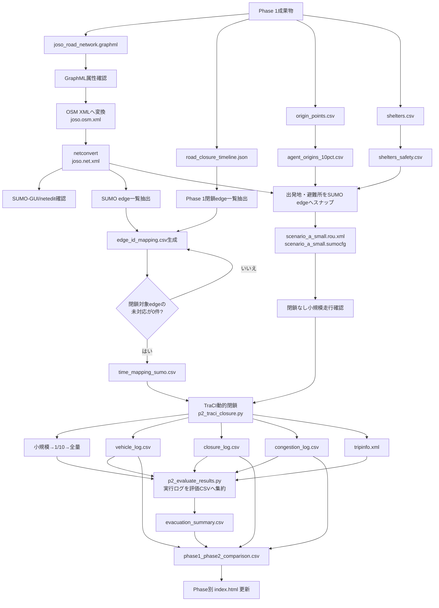
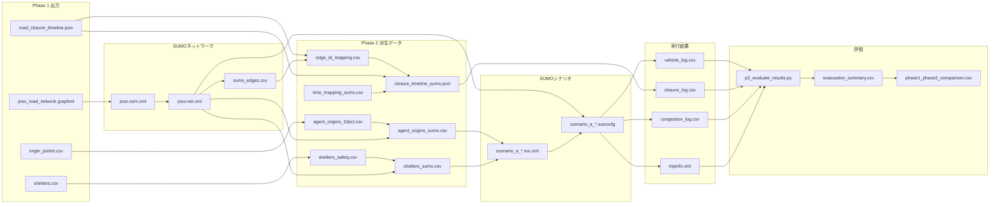
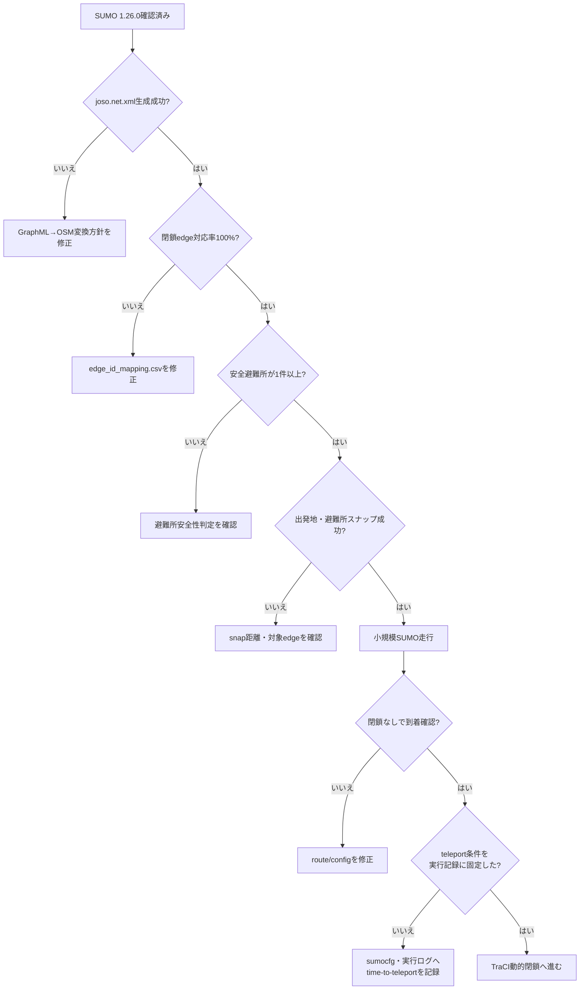

# Phase 2 実装フロー図

作成日：2026/05/14  
最終更新：2026/07/20（実行と評価の分離、teleport条件を追記）
対象：常総市実データ版 / シナリオA（自家用車のみ）

---

## 1. 実装全体フロー

---

## 2. 派生データの関係

---

## 3. 実装ゲート

> **条件の区別：** Phase 2で固定した旧small/10pct/full結果はSUMO既定のteleport 300秒を含む。Phase 3の比較正本A/Bは`time-to-teleport=-1`で実行している。両者を同一条件の結果として接続しない。
