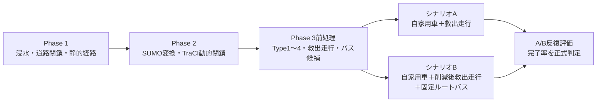
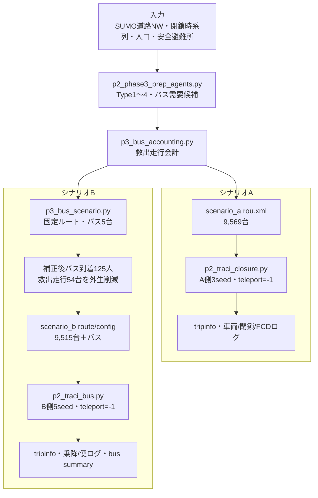
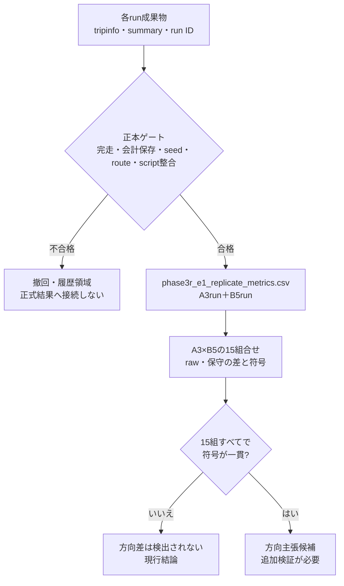
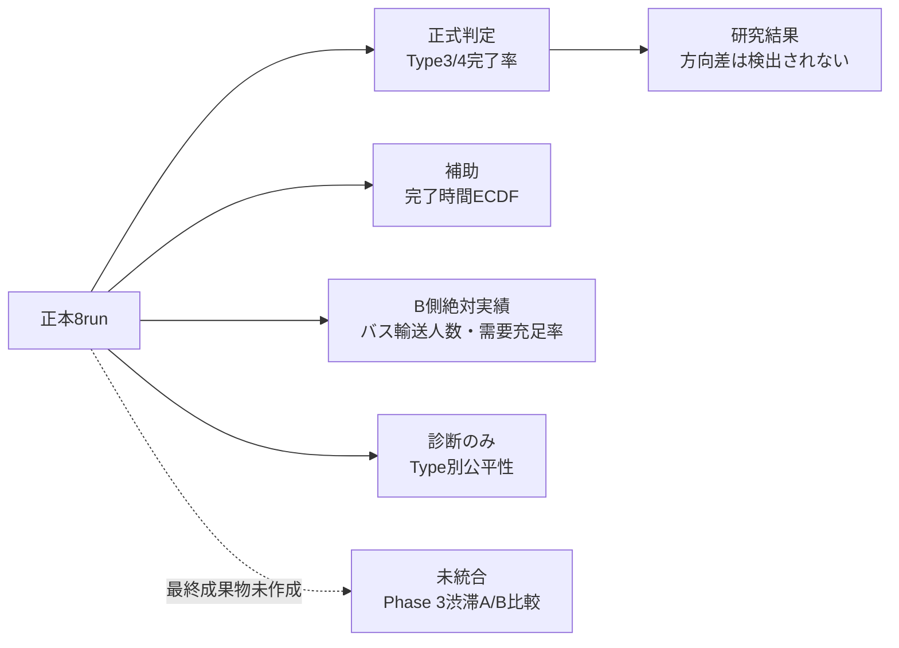
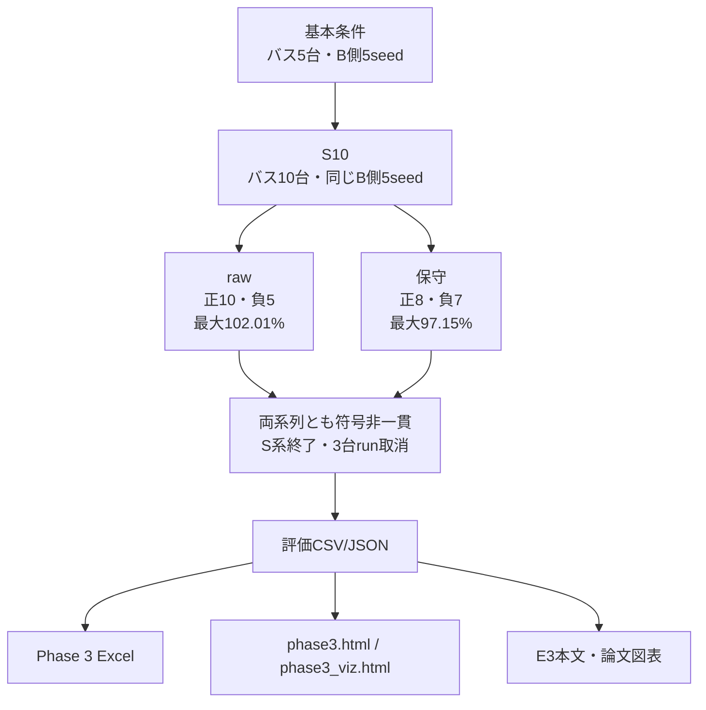

# Phase 3 実装・評価フロー図

> 作成日：2026-07-20  
> 対象：常総市先行、シナリオA/B反復比較、S10感度分析  
> 正本値：`04_プログラム/output/sumo/regions/08211/evaluation/phase3r_e1_*`  
> 注意：本図は「デマンド交通車両を転用した固定ルート避難シャトル」を扱う。需要応答型の動的配車ではない。

---

## 1. Phase 1〜3の接続

Phase 1の到達不可人口、Phase 2の旧単一run、Phase 3の人換算完了率は単位・実行条件が異なる。図中で連続した処理として接続するが、結果値を直接比較しない。

---

## 2. シナリオ生成と実行フロー

> **会計上の注意：** raw系列は救出走行到着人数換算とバス到着人数を加算する。保守系列は二重計上上限を考慮してバス人数を124.2人でcapする。個人IDによる重複除去ではないため、raw・保守を必ず併記する。

---

## 3. 正本ゲートと反復評価

15組合せは8runを組み替えた差であり、15個の独立runではない。符号一貫性は研究内の事前判定規則であり、統計的有意差・同等性を直接示すものではない。

---

## 4. 指標の分岐

| 指標 | 現在の扱い | 図表上の表現 |
|---|---|---|
| Type3/4完了率 | 正式A/B判定 | 点推定とゼロをまたぐ全組合せ範囲を併記 |
| 完了時間 | 補助 | A3・B5のECDF。A#2は到着者条件付きであることを注記 |
| 需要充足率 | B側絶対実績 | 候補247人基準とType3/4総人口3,255人基準を併記 |
| Type別公平性 | 診断 | demographicな優劣を示さない |
| 渋滞 | 未統合 | A/B効果図を作らず、未評価と明示 |

---

## 5. 感度分析と成果物

S10のraw完了率102.01%は、救出走行削減54台を固定した増車のみ設計に伴う二重計上バイアスを含む。図ではraw値を削除せず、保守値と注意書きを必ず併記する。

---

## 6. 図表作成時の禁止事項

- 点推定+1.23%ptだけを棒グラフで強調しない。
- 正13・負2を多数決として「Bが優位」と読ませない。
- B#1やA#2を外れ値として除外しない。
- A3×B5の15組を15独立runと表記しない。
- 完了時間ECDFを未到着者を含む無条件分布として扱わない。
- 現run数だけで統計的な二峰性を実証したと表現しない。
- Phase 2のteleport有効結果とPhase 3のteleport無効結果を同条件で比較しない。

