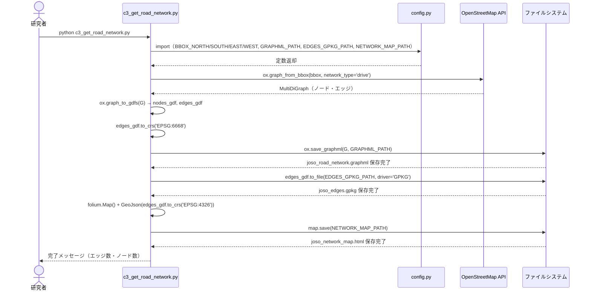
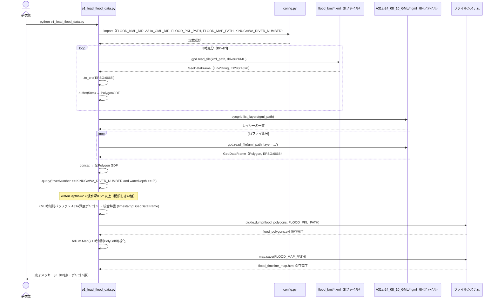
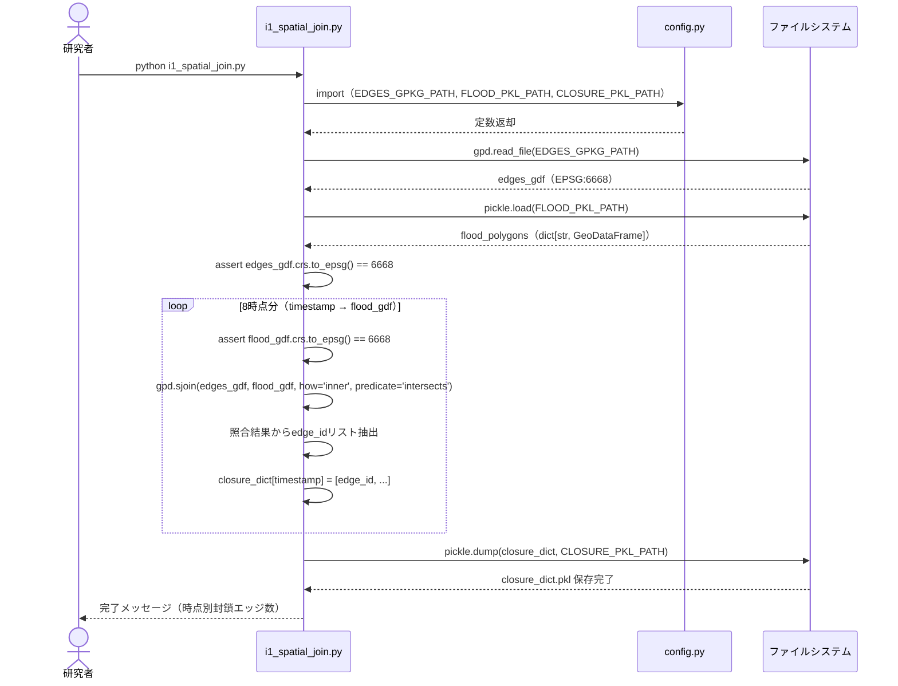
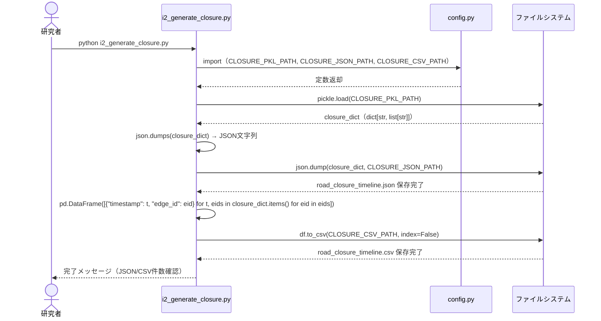
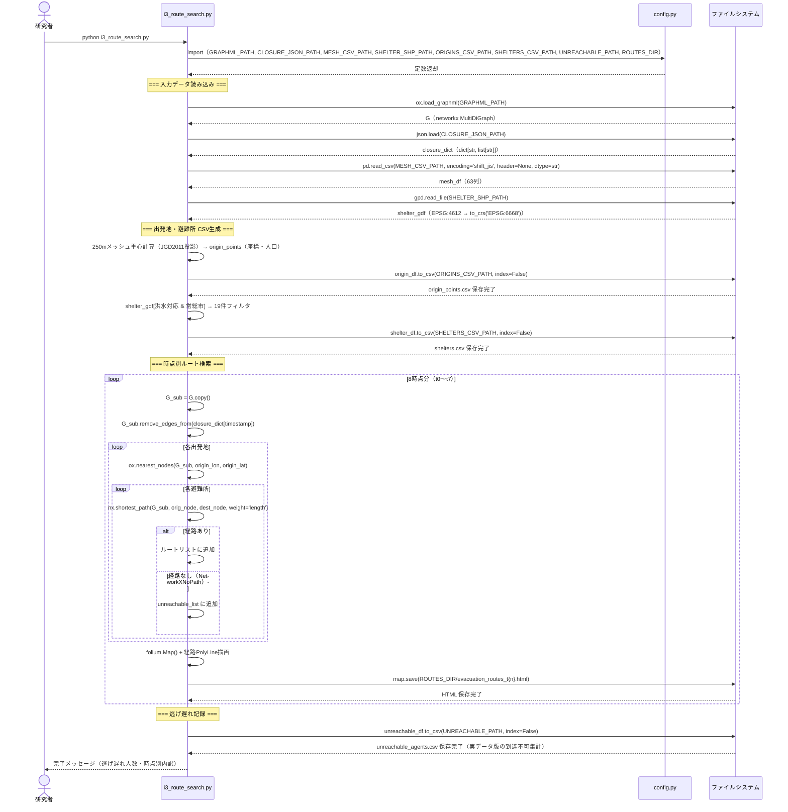
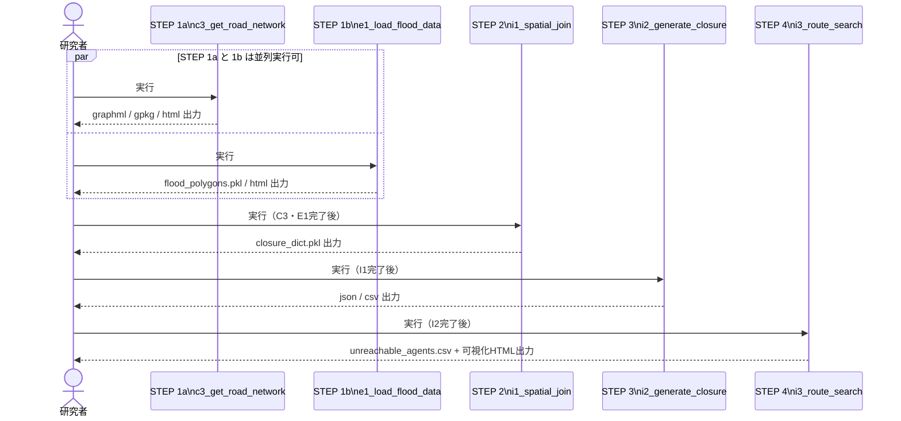
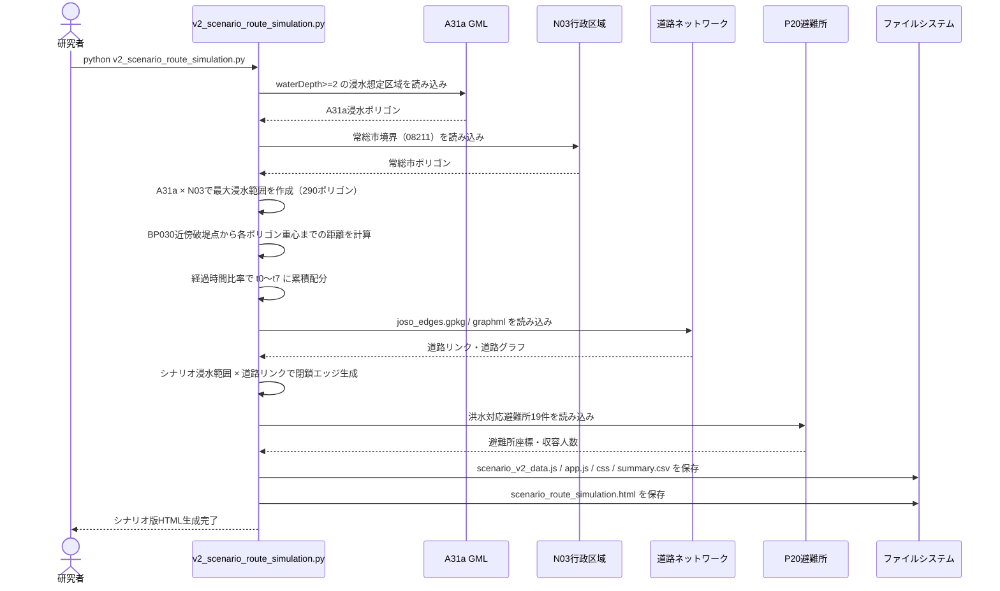
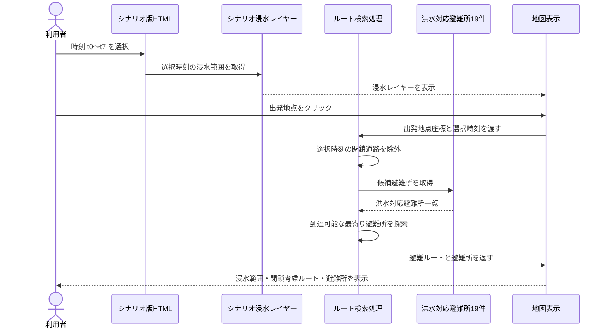
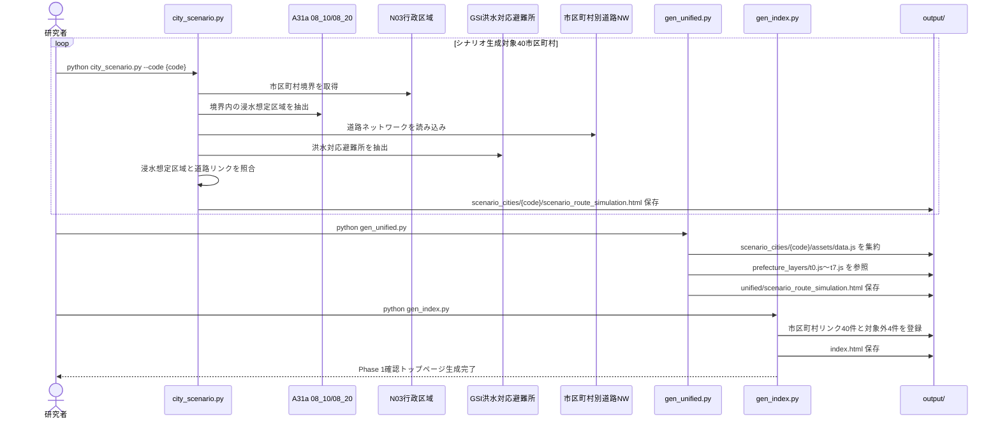
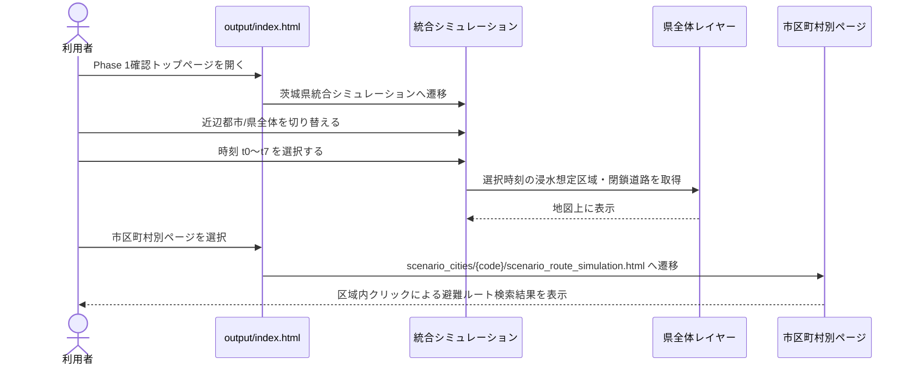

# シーケンス図

> 作成日：2026/04/28
> 対象：Phase 1 スクリプト群（常総市実データ版、常総市シナリオ版、茨城県内拡張版）の処理フロー
> 表示方法：Mermaid 図は VS Code「Markdown Preview Mermaid Support」拡張、または GitHub で自動レンダリング

---

## 1. STEP 1a — c3_get_road_network.py（道路NW取得）

---

## 2. STEP 1b — e1_load_flood_data.py（浸水データ読み込み）

---

## 3. STEP 2 — i1_spatial_join.py（浸水×道路 空間照合）

---

## 4. STEP 3 — i2_generate_closure.py（封鎖リスト生成）

---

## 5. STEP 4 — i3_route_search.py（迂回ルート検索）

---

## 6. 全STEP統合シーケンス（実行順序の概観）

---

## 7. Phase 1 シナリオ型任意地点ルート検索（最終版）

シナリオ型拡張では、`v2_scenario_route_simulation.py` がA31a最終浸水範囲を t0〜t7 に段階配分し、道路閉鎖・避難所・道路グラフをHTMLへ埋め込む。利用者は生成済みの `scenario_route_simulation.html` 上で時刻を選び、地図上の任意地点をクリックして、その時点の浸水・道路閉鎖を考慮した避難ルートを確認する。

| 項目 | 修正前 | 修正後 |
| --- | --- | --- |
| 画面操作 | t0〜t7 の HTML ファイルを個別に開く | トップページまたはシナリオ画面から時刻を選択する |
| 出発地点 | 人口メッシュ重心をプログラム側で固定 | ユーザーが地図上で任意地点をクリックする |
| 浸水確認 | 各 HTML の浸水レイヤーを目視確認 | 選択時刻のシナリオ浸水範囲を表示する |
| 道路閉鎖 | 実データ版の閉鎖タイムラインを利用 | シナリオ浸水範囲から生成した閉鎖エッジを時刻別に利用する |
| ルート確認 | 事前生成されたルートを確認 | 指定地点から到達可能な最寄り洪水対応避難所へのルートを確認する |

### 7-1. 生成処理シーケンス

### 7-2. 画面操作シーケンス

この流れにより、常総市シナリオ版は「時刻別の静的確認」だけでなく、「任意地点を想定した避難ルート確認」として説明できる。

---

## 8. Phase 1 茨城県内拡張・統合版生成（最終成果物）

茨城県内拡張版では、`city_scenario.py` が40市区町村の個別HTMLを生成し、`gen_unified.py` が県全体の統合シミュレーションを生成する。`gen_index.py` は、統合版、市区町村別版、常総市参考版、対象外4市町村をまとめたトップページを生成する。

### 8-1. 統合版の画面操作

