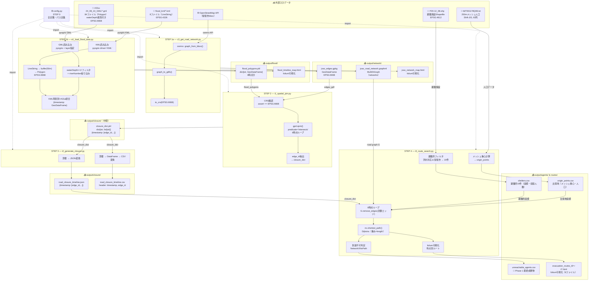
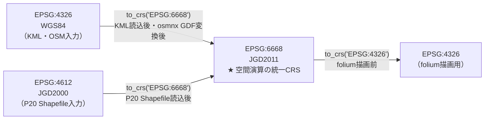

# データフロー図

> 作成日：2026/04/28
> 対象：Phase 1 スクリプト群（STEP 0〜4）のデータ変換パイプライン
> 表示方法：Mermaid 図は VS Code「Markdown Preview Mermaid Support」拡張、または GitHub で自動レンダリング

---

## 1. Phase 1 データフロー全体図

---

## 2. データ変換詳細（型・形式の変化）

```mermaid
flowchart LR
    subgraph C3変換["STEP 1a — 道路NW"]
        A1["osmnx MultiDiGraph\n（Python object）"]
        A2["GeoDataFrame\n（edges, EPSG:4326）"]
        A3["GeoDataFrame\n（edges, EPSG:6668）"]
        A4["GraphML file\n（XML形式）"]
        A5["GeoPackage file\n（バイナリ, EPSG:6668）"]
        A1 -->|"graph_to_gdfs()"| A2
        A2 -->|"to_crs('EPSG:6668')"| A3
        A1 -->|"save_graphml()"| A4
        A3 -->|"to_file(driver='GPKG')"| A5
    end

    subgraph E1変換["STEP 1b — 浸水データ"]
        B1["KML LineString\n（EPSG:4326）"]
        B2["GeoDataFrame\n（EPSG:6668）"]
        B3["Polygon GDF\n（buffer 50m）"]
        B4["GML Polygon\n（EPSG:6668, waterDepth属性）"]
        B5["統合Polygon GDF\n（waterDepth>=2 絞り込み）"]
        B6["dict[str, GeoDataFrame]\n（8時点分）"]
        B7["pickle バイナリ\n（.pkl）"]
        B1 -->|"to_crs('EPSG:6668')"| B2
        B2 -->|".buffer(50)"| B3
        B4 -->|"query(waterDepth>=2)"| B5
        B3 & B5 -->|"時刻別統合"| B6
        B6 -->|"pickle.dump()"| B7
    end

    subgraph I1変換["STEP 2 — 空間照合"]
        C1["edges_gdf\n（EPSG:6668）"]
        C2["flood_gdf\n（EPSG:6668）"]
        C3X["sjoin結果\n（edge_id列）"]
        C4["dict[str, list[str]]\n（封鎖edge_idリスト）"]
        C5["pickle バイナリ\n（.pkl）"]
        C1 & C2 -->|"gpd.sjoin(intersects)"| C3X
        C3X -->|"8時点集約"| C4
        C4 -->|"pickle.dump()"| C5
    end

    subgraph I2変換["STEP 3 — 封鎖リスト"]
        D1["dict[str, list[str]]"]
        D2["JSON文字列"]
        D3["DataFrame\n(timestamp, edge_id)"]
        D4[".json ファイル"]
        D5[".csv ファイル"]
        D1 -->|"json.dump()"| D2 --> D4
        D1 -->|"pd.DataFrame()"| D3
        D3 -->|"to_csv()"| D5
    end

    subgraph I3変換["STEP 4 — ルート検索"]
        E1X["MultiDiGraph G\n（networkx）"]
        E2["G_sub\n（封鎖エッジ除外）"]
        E3["最短経路\n（node list）"]
        E4["unreachable list"]
        E5[".csv ファイル"]
        E6["folium Map"]
        E7[".html ファイル"]
        E1X -->|"remove_edges_from()"| E2
        E2 -->|"nx.shortest_path()"| E3
        E2 -->|"NetworkXNoPath"| E4
        E4 -->|"to_csv()"| E5
        E3 -->|"PolyLine描画"| E6
        E6 -->|"map.save()"| E7
    end
```

---

## 3. CRS（座標参照系）変換フロー

**原則：** すべての空間演算（`sjoin`・`intersects`・`buffer`）はEPSG:6668に統一してから実行する。  
演算前に `assert gdf.crs.to_epsg() == 6668` で確認すること。

---

## 4. ファイル形式・依存関係サマリ

| ファイル | 形式 | 生成スクリプト | 消費スクリプト | 備考 |
|---------|------|--------------|--------------|------|
| `joso_road_network.graphml` | XML | c3 | i3 | networkx互換、キャッシュ再利用可 |
| `joso_edges.gpkg` | GeoPackage | c3 | i1 | EPSG:6668固定 |
| `joso_network_map.html` | HTML | c3 | — | ブラウザ確認用 |
| `flood_polygons.pkl` | pickle | e1 | i1 | `dict[str, GeoDataFrame]`、8時点 |
| `flood_timeline_map.html` | HTML | e1 | — | ブラウザ確認用 |
| `closure_dict.pkl` | pickle | i1 | i2 | `dict[str, list[str]]` 中間ファイル |
| `road_closure_timeline.json` | JSON | i2 | i3 | `{timestamp: [edge_id,...]}` |
| `road_closure_timeline.csv` | CSV | i2 | — | `timestamp, edge_id` 2列 |
| `origin_points.csv` | CSV | i3 | — | 出発地座標・人口 |
| `shelters.csv` | CSV | i3 | — | 避難所19件・収容人数 |
| `unreachable_agents.csv` | CSV | i3 | — | 🎯 Phase 1最終成果物 |
| `evacuation_routes_t{n}.html` | HTML | i3 | — | t0〜t7の8ファイル |
