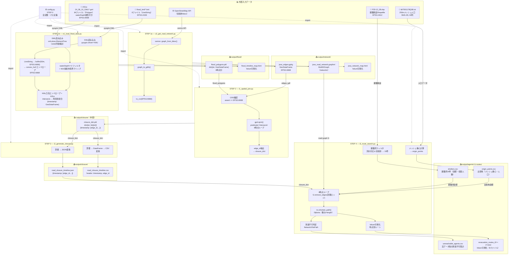
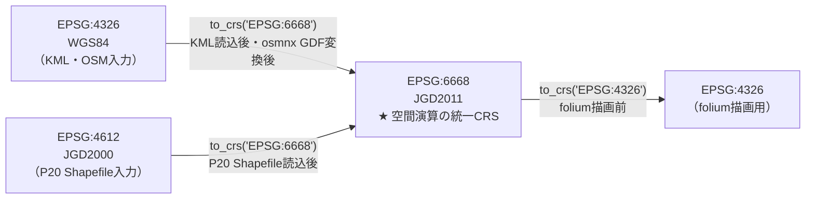
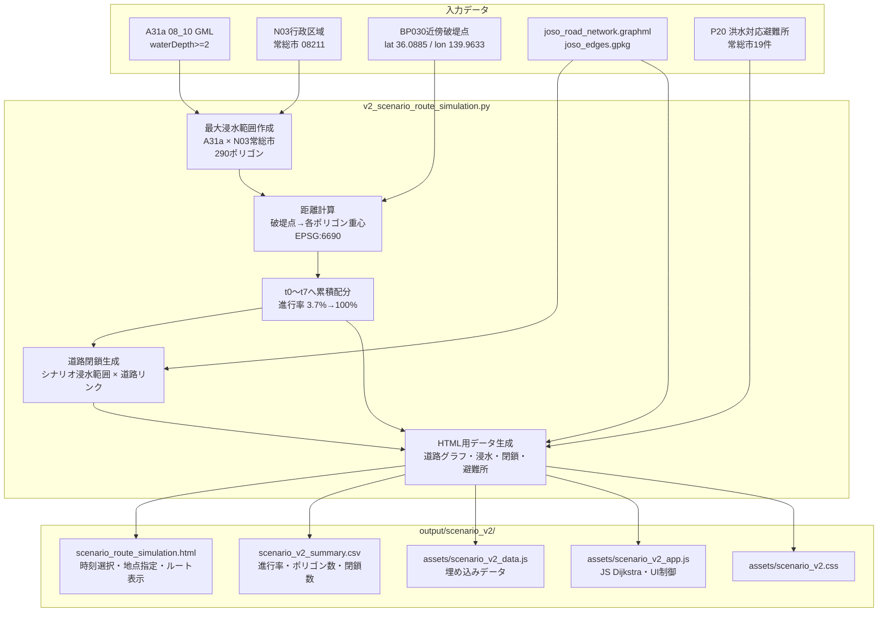
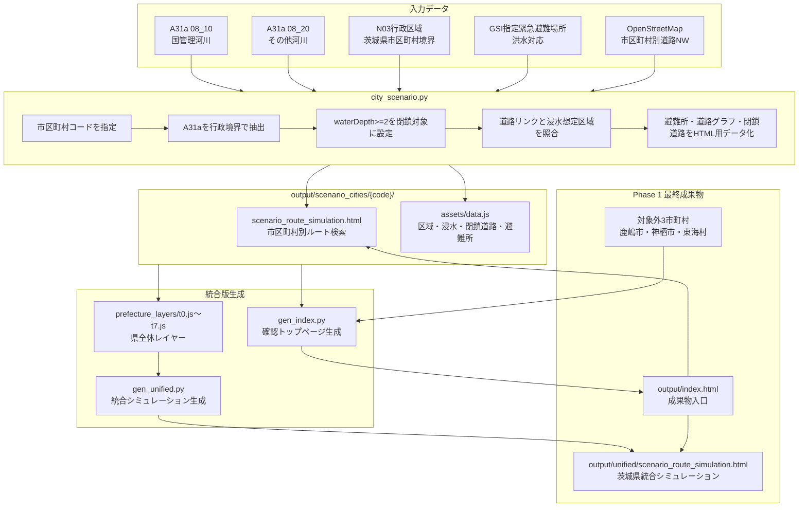

# データフロー図

> 作成日：2026/04/28
> 対象：Phase 1 スクリプト群（常総市実データ版、常総市シナリオ版、茨城県内拡張版）のデータ変換パイプライン
> 表示方法：Mermaid 図は VS Code「Markdown Preview Mermaid Support」拡張、または GitHub で自動レンダリング

---

## 1. Phase 1 常総市実データ版データフロー

---

## 2. データ変換詳細（型・形式の変化）

```mermaid
flowchart LR
    subgraph C3変換["STEP 1a — 道路NW"]
        A1["osmnx MultiDiGraph\n（Python object）"]
        A2["GeoDataFrame\n（edges, EPSG:4326）"]
        A3["GeoDataFrame\n（edges, EPSG:6668）"]
        A4["GraphML file\n（XML形式）"]
        A5["GeoPackage file\n（バイナリ, EPSG:6668）"]
        A1 -->|"graph_to_gdfs()"| A2
        A2 -->|"to_crs('EPSG:6668')"| A3
        A1 -->|"save_graphml()"| A4
        A3 -->|"to_file(driver='GPKG')"| A5
    end

    subgraph E1変換["STEP 1b — 浸水データ"]
        B1["KML LineString\n（EPSG:4326）"]
        B2["GeoDataFrame\n（EPSG:6668）"]
        B3["Polygon GDF\n（buffer 50m）"]
        B4["GML Polygon\n（EPSG:6668, waterDepth属性）"]
        B5["統合Polygon GDF\n（waterDepth>=2 絞り込み）"]
        B6["dict[str, GeoDataFrame]\n（8時点分）"]
        B7["pickle バイナリ\n（.pkl）"]
        B1 -->|"to_crs('EPSG:6668')"| B2
        B2 -->|".buffer(50)"| B3
        B4 -->|"query(waterDepth>=2)"| B5
        B3 & B5 -->|"時刻別統合"| B6
        B6 -->|"pickle.dump()"| B7
    end

    subgraph I1変換["STEP 2 — 空間照合"]
        C1["edges_gdf\n（EPSG:6668）"]
        C2["flood_gdf\n（EPSG:6668）"]
        C3X["sjoin結果\n（edge_id列）"]
        C4["dict[str, list[str]]\n（封鎖edge_idリスト）"]
        C5["pickle バイナリ\n（.pkl）"]
        C1 & C2 -->|"gpd.sjoin(intersects)"| C3X
        C3X -->|"8時点集約"| C4
        C4 -->|"pickle.dump()"| C5
    end

    subgraph I2変換["STEP 3 — 封鎖リスト"]
        D1["dict[str, list[str]]"]
        D2["JSON文字列"]
        D3["DataFrame\n(timestamp, edge_id)"]
        D4[".json ファイル"]
        D5[".csv ファイル"]
        D1 -->|"json.dump()"| D2 --> D4
        D1 -->|"pd.DataFrame()"| D3
        D3 -->|"to_csv()"| D5
    end

    subgraph I3変換["STEP 4 — ルート検索"]
        E1X["MultiDiGraph G\n（networkx）"]
        E2["G_sub\n（封鎖エッジ除外）"]
        E3["最短経路\n（node list）"]
        E4["unreachable list"]
        E5[".csv ファイル"]
        E6["folium Map"]
        E7[".html ファイル"]
        E1X -->|"remove_edges_from()"| E2
        E2 -->|"nx.shortest_path()"| E3
        E2 -->|"NetworkXNoPath"| E4
        E4 -->|"to_csv()"| E5
        E3 -->|"PolyLine描画"| E6
        E6 -->|"map.save()"| E7
    end
```

---

## 3. CRS（座標参照系）変換フロー

**原則：** すべての空間演算（`sjoin`・`intersects`・`buffer`）はEPSG:6668に統一してから実行する。
演算前に `assert gdf.crs.to_epsg() == 6668` で確認すること。

---

## 4. ファイル形式・依存関係サマリ

| ファイル | 形式 | 生成スクリプト | 消費スクリプト | 備考 |
|---------|------|--------------|--------------|------|
| `joso_road_network.graphml` | XML | c3 | i3 | networkx互換、キャッシュ再利用可 |
| `joso_edges.gpkg` | GeoPackage | c3 | i1 | EPSG:6668固定 |
| `joso_network_map.html` | HTML | c3 | — | ブラウザ確認用 |
| `flood_polygons.pkl` | pickle | e1 | i1 | `dict[str, GeoDataFrame]`、8時点 |
| `flood_timeline_map.html` | HTML | e1 | — | ブラウザ確認用 |
| `closure_dict.pkl` | pickle | i1 | i2 | `dict[str, list[str]]` 中間ファイル |
| `road_closure_timeline.json` | JSON | i2 | i3 | `{timestamp: [edge_id,...]}` |
| `road_closure_timeline.csv` | CSV | i2 | — | `timestamp, edge_id` 2列 |
| `origin_points.csv` | CSV | i3 | — | 出発地座標・人口 |
| `shelters.csv` | CSV | i3 | — | 避難所19件・収容人数 |
| `unreachable_agents.csv` | CSV | i3 | — | 実データ版の到達不可集計 |
| `evacuation_routes_t{n}.html` | HTML | i3 | — | t0〜t7の8ファイル |

---

## 5. Phase 1 シナリオ型拡張データフロー（最終版）

Phase 1 の仕上げとして、実データ版の静的ルートHTMLに加え、A31a最終浸水範囲を段階的に拡大するシナリオ版HTMLを作成した。シナリオ版は実災害の浸水推移を完全再現するものではなく、2015年鬼怒川氾濫の実データを根拠にした避難ルート探索機能の検証フローとして扱う。

| 項目 | 修正前 | 修正後 |
| --- | --- | --- |
| 浸水データ入力 | 実データ由来の時刻別浸水ポリゴン | A31a `08_10` の `waterDepth>=2` をN03常総市境界でクリップした最大浸水範囲 |
| 時系列化 | KML/浸水ナビ由来の時刻別浸水範囲 | BP030近傍破堤点からの距離分位点で t0〜t7 に累積配分 |
| 道路閉鎖 | 実データの時刻別浸水範囲と道路リンクを照合 | シナリオ浸水範囲と道路リンクを照合し、12→33本の単調増加閉鎖を生成 |
| ルート出発地 | 浸水エリアと交差した人口メッシュ重心 | 地図上でクリックした任意地点 |
| ルート出力 | 時刻ごとの静的 HTML | 時刻選択・地点指定に応じたシナリオ版 HTML |

### 5-1. シナリオ版の時点別出力

| 時点 | 時刻 | 進行率 | 採用ポリゴン数 | 閉鎖エッジ数 |
| --- | --- | ---: | ---: | ---: |
| t0 | 2015-09-10 18:00 | 3.7% | 11 | 12 |
| t1 | 2015-09-11 06:00 | 12.2% | 36 | 12 |
| t2 | 2015-09-11 18:00 | 20.6% | 60 | 15 |
| t3 | 2015-09-12 06:00 | 29.1% | 85 | 15 |
| t4 | 2015-09-12 18:00 | 37.6% | 109 | 18 |
| t5 | 2015-09-13 06:00 | 46.1% | 134 | 18 |
| t6 | 2015-09-13 18:00 | 54.6% | 158 | 20 |
| t7 | 2015-09-16 10:20 | 100.0% | 290 | 33 |

このフローにより、常総市では「実データ版の道路閉鎖・ルート探索」と「シナリオ版の任意地点ルート探索」の2系統で成果を説明できる状態になった。

---

## 6. Phase 1 茨城県内拡張・統合シミュレーションデータフロー（最終成果物）

茨城県内拡張版では、常総市シナリオ版の考え方を市区町村単位へ拡張し、41市区町村の個別HTMLと県全体を確認できる統合シミュレーションを作成した。卒論では、この統合シミュレーションを Phase 1 の主成果物として扱う。

### 6-1. 茨城県内拡張版の固定値

| 項目 | 値 |
|---|---:|
| 茨城県内市区町村数 | 44 |
| シナリオ生成対象 | 41 |
| 対象外市町村 | 3 |
| 対象外市町村名 | 鹿嶋市、神栖市、東海村 |
| 市区町村別HTML | `output/scenario_cities/{code}/scenario_route_simulation.html` |
| 統合版HTML | `output/unified/scenario_route_simulation.html` |

`output/scenario_cities/` の41ディレクトリと、`output/assets/phase1-pages.js` の市区町村リンク41件・対象外3件が一致することを確認済みである。
