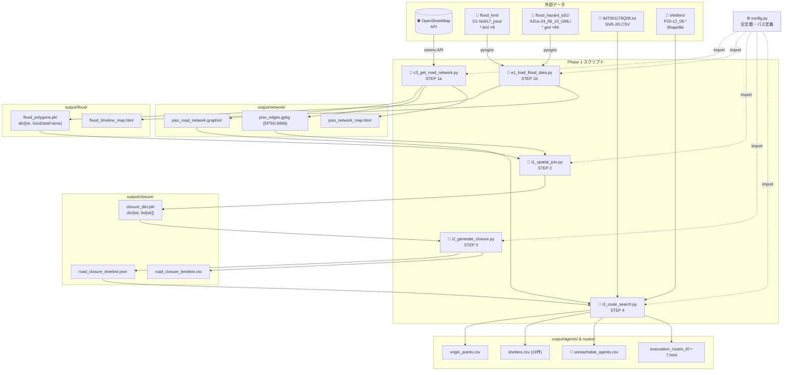
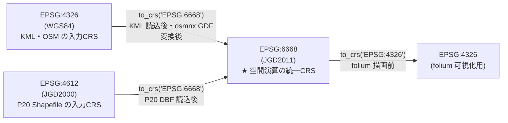

# ファイル構造図

> 作成日：2026/04/28  
> 最終更新：2026/05/19（Phase 2比較基準固定スクリプト・新規CSV追加を反映）
> 対象：Phase 1〜2 実装に関わるファイル・ディレクトリ構成
> 表示方法：Mermaid 図は VS Code「Markdown Preview Mermaid Support」拡張、または GitHub で自動レンダリング

---

## 1. ディレクトリ構成（04_プログラム/）

```
04_プログラム/
│
├── scripts/                                     Pythonスクリプト（実行単位）
│   │
│   │── 【共通】
│   ├── config.py                    ✅          全スクリプト共通定数・パス定義
│   │
│   │── 【Phase 1 実データ版】
│   ├── c3_get_road_network.py       ✅ STEP 1a  常総市道路NW取得（OSMnx）
│   ├── e1_load_flood_data.py        ✅ STEP 1b  浸水データ読み込み（KML/A31a GML）
│   ├── i1_spatial_join.py           ✅ STEP 2   浸水ポリゴン×道路エッジ空間照合
│   ├── i2_generate_closure.py       ✅ STEP 3   時刻別道路閉鎖リスト生成
│   ├── i3_route_search.py           ✅ STEP 4   Dijkstra避難ルート探索・到達不可集計
│   │
│   │── 【Phase 1 茨城県内拡張版】
│   ├── p1_city_road_network.py      ✅          茨城県全41市区町村 道路NW取得
│   ├── city_scenario.py             ✅          市区町村別シナリオHTML生成（41市区町村）
│   ├── v2_scenario_route_simulation.py ✅       常総市シナリオ版HTML生成（任意地点ルート）
│   ├── gen_unified.py               ✅          茨城県統合シミュレーション生成
│   ├── gen_index.py                 ✅          成果物トップページ（Phase別HTML）生成
│   ├── patch_city_river.py          ✅          市区町村別河川データパッチ
│   │
│   │── 【Phase 2 SUMO/TraCI】
│   ├── p2_sumo_env.py               ✅          SUMO環境検出ユーティリティ
│   ├── p2_sumo_network.py           ✅          GraphML → OSM XML → SUMO net.xml 変換
│   ├── p2_sumo_mapping.py           ✅          Phase 1 edge ID ↔ SUMO edge ID 対応表生成
│   ├── p2_sumo_snap.py              ✅          出発地・避難所の SUMO edge スナップ
│   ├── p2_derived_data.py           ✅          派生データ生成（時間軸・安全避難所・車両台数）
│   ├── p2_sumo_scenario.py          ✅          route/config XML 生成（small/10pct/full）
│   ├── p2_traci_closure.py          ✅          TraCI 動的道路閉鎖シミュレーション実行
│   ├── p2_evaluate_results.py       ✅          評価CSV・Phase 1/2 比較表・主要避難路集計・避難完了時間生成
│   ├── p2_fcd_to_json.py            ✅          FCD XML → JS変数ファイル変換・可視化HTML生成
│   ├── p2_build_phase2_excel.py     ✅          Phase 2評価CSV6種 + TrialSettings を8シートExcelへ統合
│   ├── p2_phase3_prep_agents.py     ✅          出発地をType1〜4分類・バス需要候補抽出
│   ├── p2_region_inventory.py       ✅          全域拡張対象リスト・入力棚卸し生成（41市区町村）
│   └── p2_region_pipeline.py        ✅          市区町村別 SUMO パイプライン実行器（全域バッチ）
│
├── data/                                        入力データ（読み取り専用）
│   ├── flood_kml/
│   │   └── D1-No917_joso/           ✅          国土地理院 浸水KML 8時点
│   │       └── *.kml                            各時点1ファイル（LineString のみ）
│   ├── flood_hazard_a31/
│   │   ├── A31a-24_08_10_GML/       ✅          国土数値情報 A31a GML（国管理・鬼怒川含む）
│   │   ├── A31a-24_08_20_GML/       ✅          A31a GML（都道府県管理）
│   │   ├── A31a-24_11_10_GML/       ✅          A31a GML（埼玉県国管理・五霞町調査用）
│   │   └── A31a-24_12_10_GML/       ✅          A31a GML（千葉県国管理・五霞町調査用）
│   ├── admin_boundary/
│   │   └── N03-150101_08_GML/       ✅          N03 茨城県行政区域（2015年版）
│   ├── population_mesh/
│   │   └── 5歳階級別人口250メッシュ_茨城/
│   │       └── tblT001178Q08.txt    ✅          250mメッシュ人口（Shift-JIS, 63列）
│   ├── shelters/
│   │   └── 避難施設データ_茨城/
│   │       ├── P20-12_08.shp        ✅          避難施設 Shapefile（EPSG:4612）
│   │       ├── P20-12_08.dbf                    属性テーブル（主要読み込み対象）
│   │       └── P20-12_08.*                      .shx / .prj / .cpg
│   ├── suiboumap/
│   │   └── hydrograph_origins_BP030.json ✅     浸水ナビ BP030（11メッシュ×8時点）
│   └── vehicle_stats/
│       └── 市区町村別自動車保有台数_茨城.md   ✅  H29 車両保有台数（MD変換済）
│
├── output/                                      生成ファイル出力先（.gitignore対象）
│   ├── network/                                 ← c3 の出力
│   │   ├── joso_road_network.graphml            道路グラフ（networkx）
│   │   ├── joso_edges.gpkg                      エッジ GeoDataFrame（EPSG:6668）
│   │   └── joso_network_map.html                folium 可視化
│   ├── flood/                                   ← e1 の出力
│   │   ├── flood_polygons.pkl                   {timestamp: GeoDataFrame} 辞書
│   │   └── flood_timeline_map.html              時刻別浸水範囲の folium 可視化
│   ├── closure/                                 ← i1・i2 の出力
│   │   ├── closure_dict.pkl                     {timestamp: [edge_id,...]} 辞書
│   │   ├── road_closure_timeline.json           JSON 形式閉鎖リスト
│   │   └── road_closure_timeline.csv            CSV 形式閉鎖リスト
│   ├── agents/                                  ← i3 の出力
│   │   ├── origin_points.csv                    出発地（メッシュ重心・人口付き）
│   │   └── shelters.csv                         避難所19件（座標・収容人数）
│   ├── routes/                                  ← i3 の出力
│   │   ├── evacuation_routes_t0.html〜t7.html   時点別ルート可視化（8ファイル）
│   │   └── unreachable_agents.csv              🎯 Phase 1 最終成果物（到達不可集計）
│   ├── scenario_v2/                             ← v2_scenario_route_simulation.py の出力
│   │   └── scenario_route_simulation.html       常総市シナリオ版（任意地点ルート）
│   ├── scenario_cities/                         ← city_scenario.py の出力（41市区町村）
│   │   └── {city_code}/
│   │       └── scenario_route_simulation.html
│   ├── unified/                                 ← gen_unified.py の出力
│   │   └── scenario_route_simulation.html       茨城県統合シミュレーション
│   ├── assets/                                  ← gen_index.py の出力
│   │   ├── phase1-pages.js                      市区町村リンクデータ
│   │   ├── phase1-components.js                 UI描画コンポーネント
│   │   └── phase1.css                           スタイルシート
│   ├── index.html                               成果物トップページ（Phase別入口）
│   ├── phase1.html / phase2.html / phase3.html  Phase別ページ
│   │
│   └── sumo/                                   ← Phase 2 SUMO/TraCI 出力（.gitignore対象）
│       ├── network/                             ← p2_sumo_network.py の出力
│       │   ├── joso.osm.xml                     OSM XML（GraphMLから変換）
│       │   ├── joso.net.xml                     SUMO ネットワーク（edge 49,356件）
│       │   ├── graphml_attribute_summary.md     GraphML属性確認記録
│       │   └── sumo_network_summary.md          SUMO変換サマリ
│       ├── derived/                             ← p2_sumo_mapping.py / p2_derived_data.py / p2_sumo_snap.py / p2_phase3_prep_agents.py の出力
│       │   ├── edge_id_mapping.csv              Phase 1 edge ID ↔ SUMO edge ID 対応（764件）
│       │   ├── closure_timeline_sumo.json       SUMO edge ID 版閉鎖タイムライン
│       │   ├── time_mapping_sumo.csv            t0〜t7 → SUMO秒 対応表
│       │   ├── shelters_safety.csv              安全避難所（浸水リスク判定済み）
│       │   ├── shelters_sumo.csv                避難所の SUMO edge スナップ結果
│       │   ├── agent_origins_10pct.csv          1/10試行用出発地（120台）
│       │   ├── agent_origins_sumo.csv           出発地の SUMO edge スナップ結果
│       │   ├── major_route_edge_groups.csv      主要避難路別 SUMO edge グループ
│       │   ├── agent_types.csv                  出発地別エージェント4タイプ分類（Type1〜4）
│       │   ├── bus_demand_candidates.csv        バス優先候補（Type3/4: 車非保有者）
│       │   ├── agent_type_summary.csv           タイプ別人口集計
│       │   └── *.json（validation結果）
│       ├── scenarios/                           ← p2_sumo_scenario.py の出力
│       │   ├── scenario_a_small.rou.xml / .sumocfg  小規模（40台）
│       │   ├── scenario_a_10pct.rou.xml / .sumocfg  1/10試行（120台）
│       │   └── scenario_a.rou.xml / .sumocfg        全量（1,001台）
│       ├── results/                             ← p2_traci_closure.py の出力（常総市単独）
│       │   ├── scenario_a_small_*.csv / *.xml       small試行結果
│       │   ├── scenario_a_10pct_*.csv / *.xml       10pct試行結果
│       │   ├── scenario_a_*.csv / *.xml             full試行結果
│       │   └── scenario_a_*_fcd.xml                 FCD出力（車両位置時系列）
│       ├── evaluation/                          ← p2_evaluate_results.py / p2_build_phase2_excel.py の出力
│       │   ├── evacuation_summary.csv           常総市 small/10pct/full 到着・未到着・逃げ遅れ・避難完了時間
│       │   ├── evacuation_summary_by_municipality.csv  41市区町村別評価（41行）
│       │   ├── congestion_log.csv               60秒間隔 混雑ログ
│       │   ├── major_route_congestion_summary.csv  主要4路線別混雑集計
│       │   ├── phase1_phase2_comparison.csv     常総市 Phase 1/2 比較
│       │   ├── phase1_phase2_region_comparison.csv  全域 Phase 1/2 比較（164行）
│       │   ├── trial_settings_comparison.csv    small/10pct/full 試行設定比較（表P2-4元データ）
│       │   └── phase2_results_excel.xlsx        Phase 2評価CSV統合Excelブック（8シート）
│       ├── viz/                                 ← p2_fcd_to_json.py の出力
│       │   ├── sumo_viz.html                    Leaflet.js 車両アニメーション
│       │   ├── vehicles_small.js / vehicles_10pct.js  FCD→JS変数（small/10pct）
│       │   ├── closures.js                      閉鎖道路ポリライン JS変数
│       │   └── viz_meta.js                      シミュレーション時間軸メタデータ
│       └── regions/                             ← p2_region_pipeline.py の出力（全41市区町村）
│           ├── index.html                       全域SUMO結果一覧HTML
│           ├── _management/                     バッチ管理CSV/MD
│           │   ├── phase2_region_targets.csv    対象41市区町村リスト
│           │   ├── region_batch_status.csv/md   バッチ完了状態一覧
│           │   ├── region_batch_failures.csv    失敗・隔離市区町村記録
│           │   ├── region_edge_mapping_summary.csv
│           │   └── region_run_summary.csv
│           └── {city_code}/                     市区町村別出力（41ディレクトリ）
│               ├── network/                     市区町村別 net.xml
│               ├── derived/                     edge対応・閉鎖タイムライン・スナップ
│               ├── scenarios/                   市区町村別 route/config
│               ├── results/                     small/10pct(/full) 実行結果
│               └── viz/                         市区町村別FCD可視化JS（将来用）
│
├── テスト結果_phase1/               ✅          Phase 1テスト記録ディレクトリ
│   └── テスト結果_phase1_final_20260512.md      最新テスト結果
├── テスト結果_phase2.md             ✅          Phase 2 常総市テスト記録
├── テスト結果_phase2_region.md      ✅          Phase 2 全域拡張テスト記録
├── 環境・ツール記録.md              ✅          Python/SUMO環境・バージョン記録
├── venv/                            ✅          Python 3.13.12 仮想環境
└── requirements.txt                 ✅          インストール済みライブラリ（バージョン固定）
```

### 凡例

| マーク | 意味 |
|--------|------|
| ✅ | 実装済み・存在確認済み |
| 🎯 | Phase の最終評価成果物 |
| ⏸ PhaseN | 未着手（Phase 3 以降） |

---

## 2. スクリプト間の入出力依存関係



---

## 3. ファイル形式・読み込み方法一覧

| ファイル種別 | 拡張子 | 読み込みライブラリ | 主な注意点 |
|------------|--------|----------------|-----------|
| KML（浸水時系列） | `.kml` | geopandas + pyogrio | `driver='KML'` または `'LIBKML'` を明示 |
| GML（浸水想定区域） | `.gml` | geopandas + pyogrio | `pyogrio.list_layers()` でレイヤー名確認後 `layer=` 指定 |
| メッシュ人口CSV | `.txt` | pandas | `encoding='shift_jis'`, `dtype=str`, `header=None` |
| 避難施設Shapefile | `.dbf` + `.shp` 等 | geopandas + pyogrio | `.shp`・`.shx`・`.prj` が同ディレクトリに必要 |
| 道路グラフ | `.graphml` | osmnx / networkx | `ox.load_graphml()` / キャッシュ再利用 |
| エッジGeoDataFrame | `.gpkg` | geopandas | `geopandas.read_file()` |
| 浸水ポリゴン辞書 | `.pkl` | pickle | `pickle.load()` → `dict[str, GeoDataFrame]` |
| 封鎖リスト | `.json` | json | `json.load()` → `dict[str, list[str]]` |
| 封鎖リスト | `.csv` | pandas | ヘッダ: `timestamp, edge_id` |
| 可視化地図 | `.html` | — | ブラウザで直接開く（folium 出力） |

---

## 4. CRS（座標参照系）の変換経路



**原則：** すべての空間演算（`sjoin`・`intersects`・`buffer`）は EPSG:6668 に統一してから実行する。
演算前に `assert gdf.crs.to_epsg() == 6668` で確認すること。
