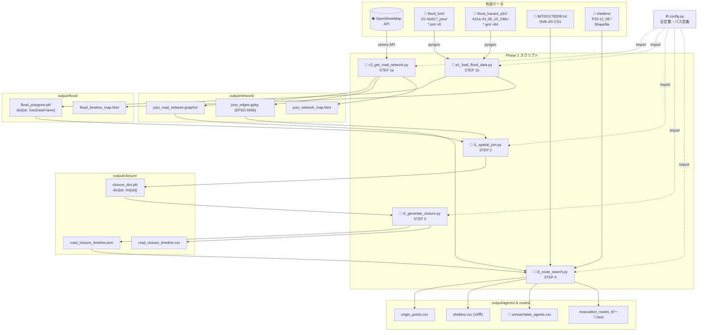
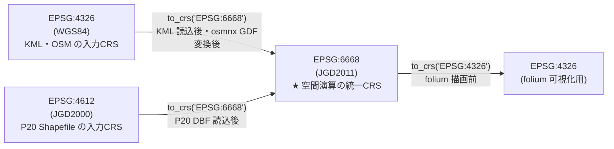

# ファイル構造図

> 作成日：2026/04/28
> 対象：Phase 1 実装に関わるファイル・ディレクトリ構成
> 表示方法：Mermaid 図は VS Code「Markdown Preview Mermaid Support」拡張、または GitHub で自動レンダリング

---

## 1. ディレクトリ構成（04_プログラム/）

```
04_プログラム/
│
├── scripts/                                     Pythonスクリプト（実行単位）
│   ├── config.py                    ✅          全スクリプト共通定数
│   ├── c3_get_road_network.py       ❌ STEP 1a  道路NW取得
│   ├── e1_load_flood_data.py        ❌ STEP 1b  浸水データ読み込み（1a と並列）
│   ├── i1_spatial_join.py           ❌ STEP 2   浸水ポリゴン×道路エッジ空間照合
│   ├── i2_generate_closure.py       ❌ STEP 3   時刻別封鎖リスト生成
│   ├── i3_route_search.py           ❌ STEP 4   迂回ルート検索・逃げ遅れカウント
│   ├── i4_convert_sumo.py           ⏸ Phase 2  SUMO ネットワーク変換
│   ├── i5_scenario_a.py             ⏸ Phase 2  シナリオA 車両エージェント
│   ├── i6_traci_simulation.py       ⏸ Phase 2  TraCI 動的道路閉鎖
│   ├── i7_scenario_b.py             ⏸ Phase 3  シナリオB バス追加
│   ├── i8_sensitivity.py            ⏸ Phase 3  台数感度分析
│   └── i9_aggregate.py              ⏸ Phase 3  集計・A/B比較
│
├── data/                                        入力データ（読み取り専用）
│   ├── flood_kml/
│   │   └── D1-No917_joso/           ✅          国土地理院 浸水KML 8時点
│   │       └── *.kml                            各時点1ファイル（LineString のみ）
│   ├── flood_hazard_a31/
│   │   └── A31a-24_08_10_GML/       ✅          国土数値情報 A31a GML
│   │       └── *.gml                            84ファイル（waterDepth 属性付き Polygon）
│   ├── population_mesh/
│   │   └── 5歳階級別人口250メッシュ_茨城/
│   │       └── tblT001178Q08.txt    ✅          250mメッシュ人口（Shift-JIS, 63列）
│   ├── shelters/
│   │   └── 避難施設データ_茨城/
│   │       ├── P20-12_08.shp        ✅          避難施設 Shapefile（EPSG:4612）
│   │       ├── P20-12_08.dbf                    属性テーブル（主要読み込み対象）
│   │       └── P20-12_08.*                      .shx / .prj / .cpg
│   └── vehicle_stats/
│       └── 市区町村別自動車保有台数_茨城.md   ✅  H29 車両保有台数（MD変換済）
│
├── output/                                      生成ファイル出力先
│   ├── network/                                 ← c3 の出力
│   │   ├── joso_road_network.graphml            道路グラフ（networkx, キャッシュ用）
│   │   ├── joso_edges.gpkg                      エッジ GeoDataFrame（EPSG:6668）
│   │   └── joso_network_map.html                folium 可視化
│   ├── flood/                                   ← e1 の出力
│   │   ├── flood_polygons.pkl                   {timestamp: GeoDataFrame} 辞書
│   │   └── flood_timeline_map.html              時刻別浸水範囲の folium 可視化
│   ├── closure/                                 ← i1・i2 の出力
│   │   ├── closure_dict.pkl                     {timestamp: [edge_id,...]} 辞書
│   │   ├── road_closure_timeline.json           JSON 形式封鎖リスト
│   │   └── road_closure_timeline.csv            CSV 形式封鎖リスト
│   ├── agents/                                  ← i3 の出力
│   │   ├── origin_points.csv                    出発地（メッシュ重心・人口付き）
│   │   └── shelters.csv                         避難所19件（座標・収容人数）
│   ├── routes/                                  ← i3 の出力
│   │   ├── evacuation_routes_t0.html            時点 t=0 のルート可視化
│   │   ├── ... (t1〜t6)
│   │   ├── evacuation_routes_t7.html            時点 t=7 のルート可視化
│   │   └── unreachable_agents.csv              🎯 逃げ遅れ（Phase 1 最終成果物）
│   └── results/                                 Phase 2〜3 用（未使用）
│       ├── evacuation_summary.csv
│       ├── congestion_summary.csv
│       ├── ab_comparison.png
│       └── sensitivity_analysis.png
│
├── venv/                            ✅          Python 3.13.12 仮想環境
└── requirements.txt                 ✅          インストール済みライブラリ（バージョン固定）
```

### 凡例

| マーク | 意味 |
|--------|------|
| ✅ | 存在済み・確認済み |
| ❌ STEP番号 | 未実装（Phase 1 実装対象） |
| ⏸ PhaseN | Phase 2〜3（未着手） |
| 🎯 | Phase 1 の最終評価成果物 |

---

## 2. スクリプト間の入出力依存関係



---

## 3. ファイル形式・読み込み方法一覧

| ファイル種別 | 拡張子 | 読み込みライブラリ | 主な注意点 |
|------------|--------|----------------|-----------|
| KML（浸水時系列） | `.kml` | geopandas + pyogrio | `driver='KML'` または `'LIBKML'` を明示 |
| GML（浸水想定区域） | `.gml` | geopandas + pyogrio | `pyogrio.list_layers()` でレイヤー名確認後 `layer=` 指定 |
| メッシュ人口CSV | `.txt` | pandas | `encoding='shift_jis'`, `dtype=str`, `header=None` |
| 避難施設Shapefile | `.dbf` + `.shp` 等 | geopandas + pyogrio | `.shp`・`.shx`・`.prj` が同ディレクトリに必要 |
| 道路グラフ | `.graphml` | osmnx / networkx | `ox.load_graphml()` / キャッシュ再利用 |
| エッジGeoDataFrame | `.gpkg` | geopandas | `geopandas.read_file()` |
| 浸水ポリゴン辞書 | `.pkl` | pickle | `pickle.load()` → `dict[str, GeoDataFrame]` |
| 封鎖リスト | `.json` | json | `json.load()` → `dict[str, list[str]]` |
| 封鎖リスト | `.csv` | pandas | ヘッダ: `timestamp, edge_id` |
| 可視化地図 | `.html` | — | ブラウザで直接開く（folium 出力） |

---

## 4. CRS（座標参照系）の変換経路



**原則：** すべての空間演算（`sjoin`・`intersects`・`buffer`）は EPSG:6668 に統一してから実行する。
演算前に `assert gdf.crs.to_epsg() == 6668` で確認すること。
