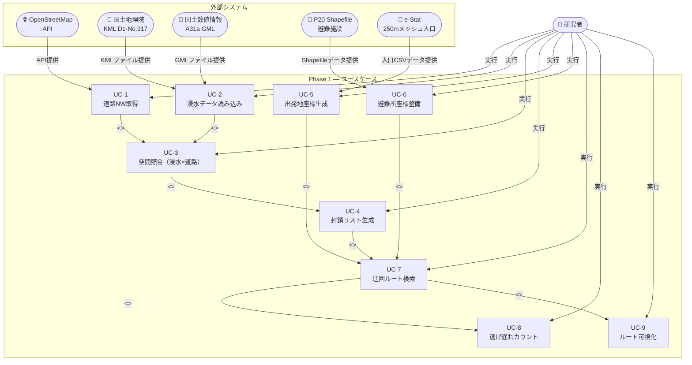

# ユースケース図

> 作成日：2026/04/28
> 対象：Phase 1 スクリプト群（STEP 1a〜4）
> 表示方法：Mermaid 図は VS Code「Markdown Preview Mermaid Support」拡張、または GitHub で自動レンダリング

---

## 1. ユースケース図（全体）

---

## 2. ユースケース詳細一覧

| UC番号 | ユースケース名 | 担当スクリプト | STEP | 概要 |
|--------|--------------|--------------|------|------|
| UC-1 | 道路NW取得 | `c3_get_road_network.py` | 1a | osmnxで常総市の道路ネットワークを取得し、GraphML・GeoPackage・HTML地図を出力する |
| UC-2 | 浸水データ読み込み | `e1_load_flood_data.py` | 1b | 国土地理院KML（8時点）とA31a GMLを読み込み、浸水ポリゴン辞書とHTML地図を出力する |
| UC-3 | 空間照合（浸水×道路） | `i1_spatial_join.py` | 2 | 各時点の浸水ポリゴンと道路エッジをEPSG:6668で重ね合わせ、封鎖候補エッジIDを抽出する |
| UC-4 | 封鎖リスト生成 | `i2_generate_closure.py` | 3 | 8時点分の封鎖エッジIDリストをJSON・CSV形式で出力する |
| UC-5 | 出発地座標生成 | `i3_route_search.py` | 4 | 250mメッシュ重心を出発地とし、浸水エリア内の人口付き座標CSVを生成する |
| UC-6 | 避難所座標整備 | `i3_route_search.py` | 4 | P20 Shapefileから常総市の洪水対応避難所19件の座標CSVを生成する |
| UC-7 | 迂回ルート検索 | `i3_route_search.py` | 4 | 封鎖リストを適用したグラフで各出発地から最寄り避難所へのDijkstra最短経路を8時点計算する |
| UC-8 | 逃げ遅れカウント | `i3_route_search.py` | 4 | 経路が存在しないエージェントを逃げ遅れとして記録し、CSVに出力する |
| UC-9 | ルート可視化 | `i3_route_search.py` | 4 | 時点別の避難ルートをfoliumでHTML地図として出力する |

---

## 3. ユースケース別 入出力仕様

| UC番号 | 主要入力 | 主要出力 |
|--------|---------|---------|
| UC-1 | osmnx APIレスポンス（常総市bbox） | `joso_road_network.graphml`, `joso_edges.gpkg`, `joso_network_map.html` |
| UC-2 | `flood_kml/*.kml` ×8, `A31a-24_08_10_GML/*.gml` ×84 | `flood_polygons.pkl`, `flood_timeline_map.html` |
| UC-3 | `joso_edges.gpkg`, `flood_polygons.pkl` | `closure_dict.pkl`（中間成果） |
| UC-4 | `closure_dict.pkl` | `road_closure_timeline.json`, `road_closure_timeline.csv` |
| UC-5 | `tblT001178Q08.txt`（Shift-JIS, 250mメッシュ人口） | `origin_points.csv` |
| UC-6 | `P20-12_08.shp`（EPSG:4612） | `shelters.csv`（19件） |
| UC-7 | `joso_road_network.graphml`, `road_closure_timeline.json`, `origin_points.csv`, `shelters.csv` | 最短経路リスト（内部計算） |
| UC-8 | UC-7 の経路計算結果 | `unreachable_agents.csv` |
| UC-9 | UC-7 の経路計算結果 | `evacuation_routes_t0.html` 〜 `evacuation_routes_t7.html` |

---

## 4. アクター詳細

| アクター | 種別 | 役割 |
|---------|------|------|
| 研究者 | 主アクター（人間） | 各スクリプトを順序通りに実行し、出力を確認する |
| OpenStreetMap API | 外部システム | osmnxを通じて道路ネットワークデータをJSON形式で提供する |
| 国土地理院 KML | 外部システム | 2015/09/10〜09/16の8時点分の浸水LineString KMLを提供する |
| 国土数値情報 A31a GML | 外部システム | 浸水想定区域ポリゴン（waterDepth属性付き）を84ファイルで提供する |
| P20 Shapefile | 外部システム | 茨城県避難施設データ（EPSG:4612）を提供する |
| e-Stat 250mメッシュ | 外部システム | 250mメッシュ単位の5歳階級別人口データ（Shift-JIS CSV）を提供する |

---

## 5. 事前条件・事後条件・確認基準

| UC番号 | 事前条件 | 事後条件 | 確認基準 |
|--------|---------|---------|---------|
| UC-1 | インターネット接続可、osmnxインストール済 | GraphML・GPKG・HTMLが `output/network/` に存在 | `joso_edges.gpkg` のエッジ数 > 0 |
| UC-2 | KML・GML展開済、pyogrioインストール済 | PKLとHTMLが `output/flood/` に存在 | `len(flood_polygons) == 8`（8時点） |
| UC-3 | UC-1・UC-2完了、PKL・GPKGが存在 | `closure_dict.pkl` が `output/closure/` に存在 | `len(closure_dict) == 8` |
| UC-4 | UC-3完了、`closure_dict.pkl` が存在 | JSON・CSVが `output/closure/` に存在 | JSONのキー数 == 8 |
| UC-5 | メッシュCSV（Shift-JIS）が存在 | `origin_points.csv` が `output/agents/` に存在 | 常総市メッシュ重心件数 > 0 |
| UC-6 | P20 Shapefileが存在（`.shp`・`.shx`・`.prj`・`.dbf`） | `shelters.csv` が `output/agents/` に存在 | `len(shelters_df) == 19` |
| UC-7 | UC-4・UC-5・UC-6完了、全入力ファイルが存在 | 8時点分の経路計算完了（内部） | エラーなく完走 |
| UC-8 | UC-7完了 | `unreachable_agents.csv` が `output/routes/` に存在 | CSVに逃げ遅れ数（0以上）が記録 |
| UC-9 | UC-7完了 | `evacuation_routes_t0〜t7.html` が `output/routes/` に存在 | 8ファイルが存在し、ブラウザで表示可 |
