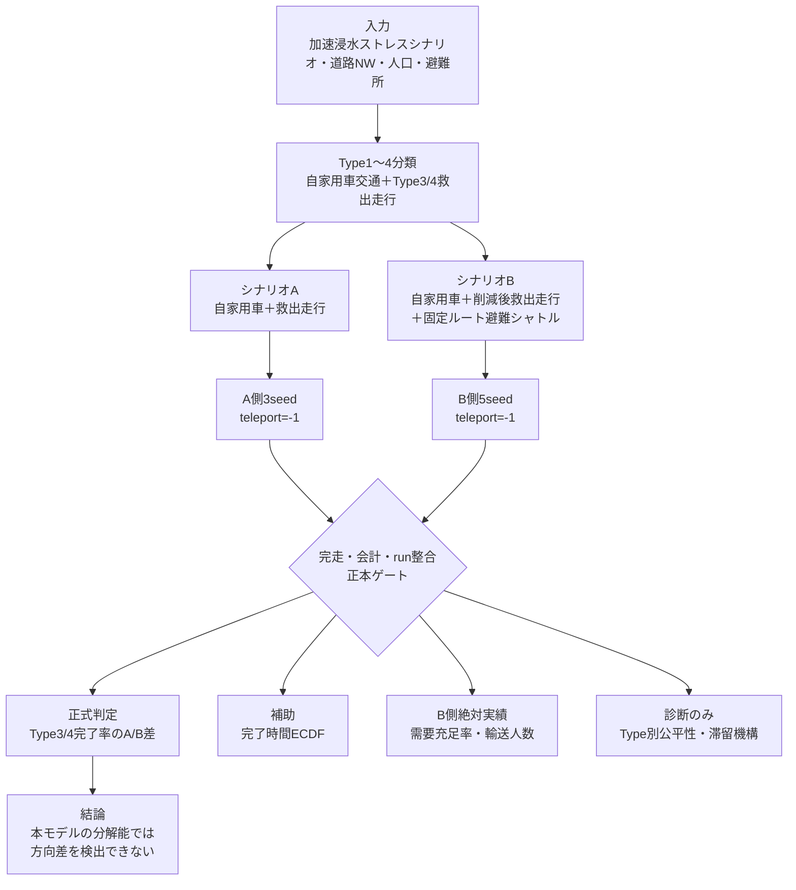

# 評価フレーム設計

> 作成日：2026/04/10  
> 最終更新：2026/07/20（Phase 3正本フロー・評価区分へ更新）
> ステータス：**現行実装反映済み（未評価指標は明示）**

> **⚠️ 正本更新（2026-07-03）：本書の「逃げ遅れ」「避難完了」の定義は `用語定義集.md` で正本化された。正本＝避難完了は指定避難所への到着、逃げ遅れは終了時点で避難所未到着の人数（人単位、車両→人換算あり）。本書中の「浸水エリア脱出」は補助指標「エリア離脱」として扱う。A/B比較は人単位で行う。**
> **⚠️ 公平性指標の明示（T-D-S1・2026-07-03／2026-07-12確定）：研究目的の「公平性」は、Type別（特にType3/4＝交通弱者）の避難完了率・平均避難完了時間・逃げ遅れ内訳で測る。時間軸は加速浸水シナリオのため、逃げ遅れの絶対数でなくA/B相対比較・Type別分布差で評価する（[[時間軸_方針判断_fable5]]）。**
> **床効果再評価（T-D-C2）は完了：A'（teleport=-1）で床効果は不成立と確定（決定31〜36）。主指標の最終判定も完了：Type3/4完了率のA/B差はヌル（決定105/106）。** Type別完了率のうち**A側の型内水準差（type4最高等）は救出走行機構アーティファクト（vehicle_kind=Typeが1対1・按分shadow）であり demographic 解釈は禁止**（決定46）。主張はA/B相対Δに限定し、④完了率のみを正式な符号一貫性判定にかける（決定108）。

---

## 評価の基本構造

---

## シナリオA（ベースライン）の定義

**「自家用車交通に、Type3/4を運ぶ救出走行を加える（バスなし）」**

- 自家用車保有世帯は車両で避難する
- 自家用車非保有者・高齢者（Type3/4）は救出走行で送迎する
- バスは存在しない
- 道路閉鎖：浸水深0.5m以上の道路リンクは通行不可
- 比較正本は`time-to-teleport=-1`、A側3seedで評価する

**選定理由：** 現実の鬼怒川2015年氾濫時の状況（住民が一斉に車で逃げようとして渋滞が発生した）に最も近い。

---

## シナリオB（提案）の定義

**「デマンド交通バス（平常時シャトル）を災害時運用に切り替えて活用する」**

### バスの設定

| 項目 | 平常時 | 災害時 |
|------|--------|--------|
| 運行形態 | 固定ルートシャトル（住宅街→病院→買い物） | **固定ルートの避難シャトル（ピストン輸送）** |
| 主な利用者 | 高齢者（任意利用） | 高齢者・自家用車非保有世帯（優先的に乗車） |
| 運行頻度 | 低頻度（1日数便） | 可能な限り往復輸送 |
| 車両容量 | 複数乗車可能なバス（定員設定は仮定として別途定義） |

### バスが道路に与える影響

- 補正後のバス到着125人を2.3人/台で換算し、救出走行54台を外生的に削減する
- バス輸送と救出走行到着の重複可能性を考慮し、raw系列と保守系列を併記する
- 渋滞緩和や完了率改善は事前仮説であり、結果として前提にしない

---

## 評価指標の定義

| 指標 | 定義 | 測定方法 |
|------|------|---------|
| **Type3/4避難完了率** | 指定終了時刻までに避難所へ到着したType3/4相当人数の割合 | **正式なA/B判定対象**。固定分母3,231.5人、raw・保守系列 |
| **Type3/4避難完了時間** | 到着者の避難完了時間分布 | ECDFを完了率と対で示す。生存者バイアスのため補助評価 |
| **需要充足率・バス輸送人数** | 候補247人・Type3/4総人口3,255人に対するバス到着人数 | B側絶対実績。A/B差には使用しない |
| **Type別公平性** | Type3/4内訳・worst-off等 | 現状は診断のみ。demographicな方向主張をしない |
| **逃げ遅れ・未到着** | 終了時点で指定避難所へ未到着 | 従指標。A/B符号は非一貫 |
| **渋滞発生規模** | 平均速度・停止台数・旅行時間等 | Phase 3の最終A/B統合成果物は未作成。現時点で方向主張しない |

---

## 評価シナリオ（浸水規模別）

| シナリオ | 浸水規模 | 浸水進行速度 | 目的 |
|---------|--------|------------|------|
| **実事例再現** | 2015年鬼怒川氾濫と同等 | 実際の時系列データに基づく | 現実との照合・検証 |
| **軽微** | 実事例より小規模 | 緩やか | 渋滞緩和効果が出やすい条件 |
| **大規模** | 実事例より大規模 | 速い | バスの限界・逃げ遅れが多い条件 |

---

## シミュレーションツールの選定（確定：SUMO 1.26.0）

> **✅ 確定（Phase 2実装済み）：** SUMO 1.26.0を採用。導入手順は`phase2/Phase2_SUMO導入・変換手順.md`、引用・再現性情報は`phase2/Phase2_SUMO引用・再現性メモ.md`を参照。

| ツール | 特徴 | 本研究への適合性 |
|--------|------|--------------|
| **SUMO** | 交通流シミュレーション特化。道路の渋滞・車両フローを精密に再現 | ★★★ 渋滞比較に最適。JIPR2025論文でも使用 |
| **MATSim** | エージェントベース。DRTモジュールあり。バスの動的ルートも設定可能 | ★★★ バスの動的運用と交通流を同時に扱える（不採用） |
| **Python独自** | 柔軟だが工数が大きい。検証が難しい | ★☆☆ 卒論スコープでは難易度が高い（不採用） |

**方針（確定）：** SUMOを採用（C-4の意思決定事項は完了）。

---

## 鬼怒川2015年氾濫データとの照合

実際の鬼怒川2015年氾濫では：
- 常総市を中心に広域浸水
- 道路渋滞により避難が困難になった事例が多数記録されている
- 逃げ遅れた住民数・孤立した住民数のデータが存在する可能性がある

**照合の方針：**
- シナリオAのシミュレーション結果と実際の逃げ遅れ数を比較し、モデルを検証する
- 実数と一致すれば「モデルが現実を再現できた」として、シナリオBの結果に信頼性が生まれる

---

## 成功基準（論文として成立する最低ライン）

> **⚠️ 2026-07-12 改訂（[[段4_主指標ヌル確定_方針判断_fable5]] 決定105〜111・[[A_prime結果解釈_方針判断_fable5]] 決定31〜36）：** 旧成功基準は「シナリオBで逃げ遅れが減少することを示す」＝**方向性のある効果の検出**を前提にしていた。段3Rシード変動レプリケーション（A側3run＋B側5run）の結果、主指標（Type3/4完了率）のA/B差は**「本モデルの分解能では検出されない」＝ヌル**で確定した（15組合せ符号が非一貫・決定105/106）。**このヌルは失敗ではなく、段3停止時（決定79）に事前コミットした受容可能な帰結**であり、以下の改訂基準で卒論は成立する。方向主張（「バスで逃げ遅れが減る/増える」）は本文・要旨・図表で全面禁止。

以下が定量的に示せれば卒論として成立する（改訂）。

1. **シナリオA（teleport=-1・テレポート無効）で渋滞由来の滞留（避難所未到着）が発生することを示せる**（現実との照合）。**A'で未到着479台（arrived 9,090/9,569）を確認済み＝「床効果」（渋滞由来の逃げ遅れは発生しない）は不成立と確定**（旧R4の「全到着」はSUMO既定300秒テレポートが渋滞を消した結果・決定31〜36）。
2. **A/Bの主指標（Type3/4避難完了率・分母固定3,231.5人）を、シード変動レプリケートの帯付きで比較できる**。結果は**「本モデルの分解能では方向性のある差は検出されない」（ヌル・15組合せ符号が非一貫〔raw 正13/負2・保守 正13/負2〕・点推定+1.23%pt・帯[−3.09,+22.97]%ptがゼロをまたぐ・実データ算出＝決定126〜144・`e2004d7`回帰を撤回）**。定量的A/B主張は④完了率のヌル一本に集約し、①完了時間はECDF重ね描き・②需要充足率はB側絶対値（候補247基準50.6%／全Type3/4基準3.8%）・③Type別は診断のみとする（決定108）。
3. **シード変動レプリケーションにより初期条件感応性（regime bimodality）を同定し、単一runの避難シミュレーション結果の信頼性への方法論的貢献を示せる**（A#2 seed42が完了率75%のロックregimeを示した＝同一モデル・シードのみ差で大差・決定107）。バス台数感度は決定109で縮小実施（10台×5run・ヌルの頑健性の傍証）。

---

## 未確定事項

- [x] シミュレーションツールの確定 → **✅ SUMO 1.26.0に確定・Phase 2で実装済み**
- [ ] 鬼怒川2015年の実データ（浸水時系列・逃げ遅れ数・渋滞記録）の取得可能性
- [ ] バスの台数・容量の具体的な設定（常総市の実態に基づくか、仮定とするか）
- [ ] 「逃げ遅れ」の判定基準（浸水到達時に浸水エリア内にいる人 vs. 実際に救助が必要だった人）
