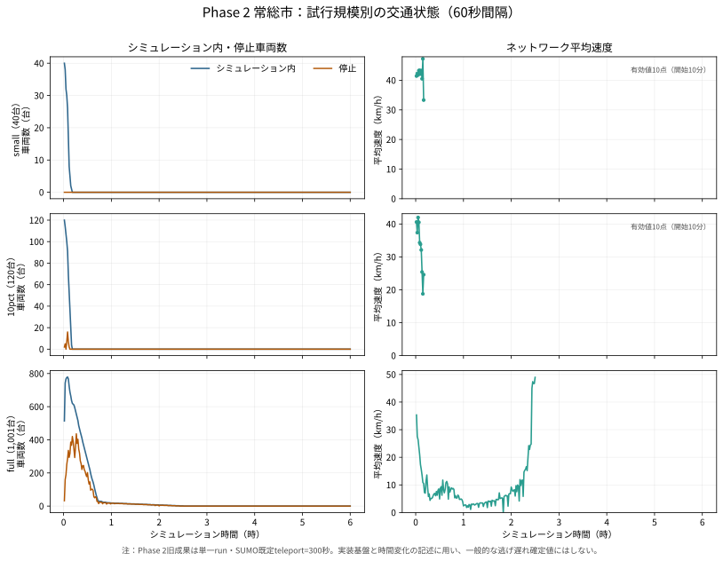
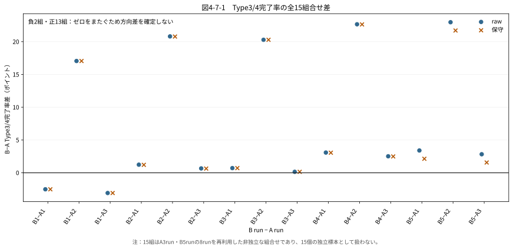
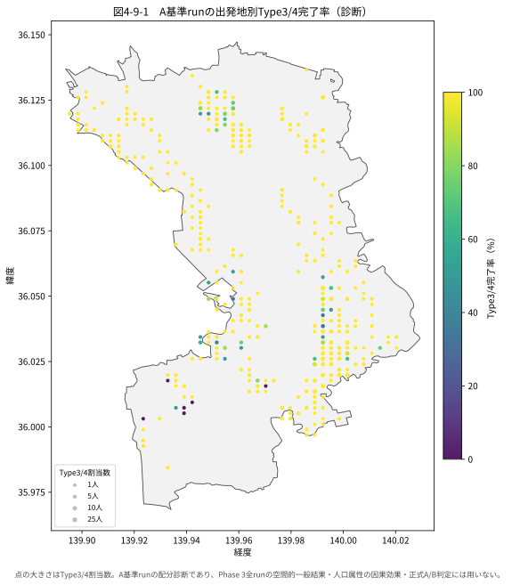
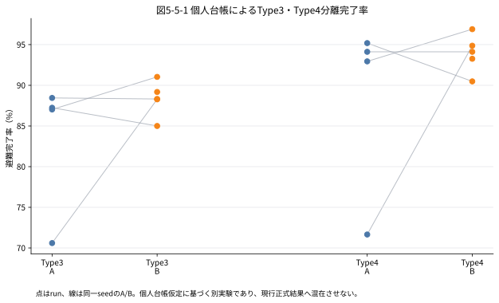
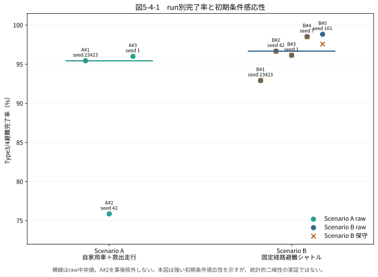

# 卒論本文ドラフト（Phase 1〜3統合）

> 作成日：2026-07-21  
> 状態：研究深化の推奨順序①〜④を反映した統合本文ドラフト  
> 数値・結論の正本：`../06_研究結果/研究結果・結論固定_20260721.md`  
> 用途：卒論本文へ転記・校正するための第1章〜第6章の通読用原稿

## 本文で用いる用語

- **Scenario A**：自家用車8,164台と、車を利用できないType3/4を送る救出走行1,405台からなる、バスを導入しない条件。
- **Scenario B**：自家用車8,164台、救出走行1,351台、デマンド交通車両を転用した固定経路避難シャトルからなる条件。
- **固定経路避難シャトル**：あらかじめ定めた乗降地点と避難所の間を往復するバス。本研究のScenario Bは、予約に応じて配車順序や経路を最適化する動的DRTではない。
- **Type3/4**：本研究で交通弱者として正式評価する、車を利用できない人を含む区分。
- **run**：一つの乱数シードで最後まで実行した1回のシミュレーション。

---

# 第1章　序論

## 1.1 研究背景

河川氾濫時の自動車避難では、浸水による道路閉鎖だけでなく、多数の車両が同時に移動することで生じる渋滞も避難の成否に影響する。また、高齢者や自家用車を利用できない人は、道路上に経路が残っていても、自力で避難所へ移動できない場合がある。このため、避難計画を評価するには、道路が通行可能かという静的な確認、車両相互作用を含む動的な交通流、交通手段を持たない人の輸送を段階的に扱う必要がある。

本研究は、2015年9月の鬼怒川氾濫で大きな被害を受けた茨城県常総市を主対象とする。国土地理院や国土数値情報等の公開・公的データを用い、浸水に伴う道路閉鎖と避難所への移動をモデル化した。そのうえで、SUMO/TraCIを用いて自家用車と救出走行を動かし、デマンド交通車両を固定経路避難シャトルへ転用した場合を比較した。

## 1.2 研究目的

本研究の目的は、河川氾濫時の道路閉鎖下で、自家用車と救出走行による避難に固定経路避難シャトルを加えたとき、Type3/4避難完了率に方向性のある差を本モデルで検出できるかを明らかにすることである。

研究課題は次のとおりである。

> 常総市の加速浸水ストレス条件において、自家用車と救出走行からなるScenario Aと、デマンド交通車両転用型の固定経路避難シャトルを加えたScenario Bの間で、Type3/4避難完了率に一貫した改善または悪化を確認できるか。

## 1.3 研究の構成

分析は三つのPhaseで構成した。

1. Phase 1では、浸水時系列に応じて道路を閉鎖し、閉鎖道路を除外した静的最短経路と避難所到達可否を求める。
2. Phase 2では、Phase 1の道路閉鎖をSUMO/TraCIへ接続し、車両相互作用、渋滞、動的閉鎖、再経路探索を実装する。
3. Phase 3では、救出走行を含むScenario Aと固定経路避難シャトルを加えたScenario Bを複数runで比較する。

## 1.4 本研究の新規性と貢献

本研究の特徴は、人口、道路、浸水、避難所の公開・公的データを同一基盤へ接続し、静的到達性、動的交通流、交通弱者輸送を一続きの処理として実装した点にある。さらに、Scenario AとScenario Bを複数の乱数シードで評価し、単一runの結果だけで公共交通導入の優劣を判断しない評価規則を採用した。

本研究の主な貢献は、固定経路避難シャトルの効果を断定したことではない。道路閉鎖と交通流を含む条件ではrun間変動が大きく、現在のモデル分解能ではScenario A/B間の方向差を安定して検出できないことを示した点、ならびに再現可能な比較基盤を構築した点にある。

---

# 第2章　先行研究と本研究の位置づけ

## 2.1 洪水避難と避難行動

洪水避難の既往研究では、高齢者等の移動制約、避難準備時間、避難所の認知、警報後の出発遅れが避難結果を左右することが示されている。Nakanishi et al. (2019)は日本の高齢地域を対象に、移動制約と避難時間を含む複数シナリオを扱った。洪水時の避難行動を扱う研究では、避難所の認知や即時出発の有無が到着時刻へ影響することが指摘されている。

本研究は、人口属性をType1〜4へ区分し、Type3/4の完了率と完了時間を記録する。一方、警報認知から出発までの時間分布や、支援者の有無は実測値で校正していない。このため、警戒レベル3・4と決壊後の出発を比較する問題は、本研究の確定結果とは分離した将来実験とする。

## 2.2 避難交通シミュレーション

既往の避難シミュレーションには、人口、道路、浸水、避難所、歩行者、車両、準備時間をエージェントとして扱う研究や公開モデルがある。また、洪水インシデント管理モデルでは、洪水進行、施設破損、警報、避難開始を連動させる枠組みが示されている。

本研究では、道路閉鎖時系列を作成し、SUMOの微視的交通流とTraCIによる動的制御を組み合わせた。車両ごとの移動、停止、再経路探索、未到着を記録することで、道路上に経路が存在するかだけでなく、車両相互作用による混雑を扱う。ただし、実際の住民行動全体を再現するものではなく、常総市の加速浸水ストレス条件における比較モデルとして位置づける。

## 2.3 公共交通を用いた避難支援

自家用車と公共交通を組み合わせた避難研究では、避難完了人数だけでなく、待ち時間、車内時間、車両数、運行費用、公平性を同時に検討する必要性が示されている。SUMO公式DRTやArmellini (2021)の実装は、予約、最大待ち時間、定員、迂回率、動的配車を扱う。近年のバス避難研究では、混雑フィードバック、複数便、地域公平性も評価されている。

本研究のバスは、既存のデマンド交通車両を災害時に転用する想定であるが、運行方式は事前に定めた乗降地点と避難所の間を往復する固定経路である。したがって、現行Scenario Bを動的DRTと呼ばず、固定経路避難シャトルと呼ぶ。また、現行ログには予約時刻や待機開始時刻がないため、待ち時間は算出せず、乗車から到着までの車内時間だけを記述する。

## 2.4 エージェントベースモデルの記述と再現性

Grimm et al. (2020)のODDは、エージェントベースモデルをOverview、Design concepts、Detailsの順で記述する標準的枠組みである。本研究もODDに準拠して、目的、主体、状態、時間・空間スケール、処理順、相互作用、確率性、初期化、入力、サブモデル、評価可能範囲を整理した。

さらに、run ID、乱数シード、入力routeのSHA256、車両数、設定ファイル、実行結果をmanifestへ保存し、異なるrunの成果物が混在しないようにした。正本ゲートを通過したrunだけを正式評価へ接続する。

## 2.5 本研究の位置づけ

本研究は、常総市を対象に、道路閉鎖、車両交通、救出走行、固定経路避難シャトルを一つの再現可能な比較基盤へ統合する。先行研究との関係を表2-1に示す。

**表2-1　先行研究に対する本研究の実施範囲**

| 論点 | 本研究で実施した内容 | 本研究で未実施の内容 |
|---|---|---|
| 高齢者・車非保有者 | Type3/4分類、完了率、完了時間 | 支援者、準備時間の実測校正 |
| 洪水と道路 | 浸水時系列、道路閉鎖、再経路探索 | 浸水深・流速に応じた連続速度低下 |
| 公共交通 | 固定乗降地点、複数便、輸送人数、車内時間 | 予約、待ち時間、動的配車最適化 |
| 公平性 | Type別・出発地別の診断 | 地域別最低サービス水準の正式制約 |
| 再現性 | ODD記述、seed、run ID、SHA、manifest | 実避難・実運行データによる外部校正 |

以上から、本研究の貢献は動的DRTの最適運用を確立することではなく、比較可能な基盤を構築し、その基盤で識別可能な結果と識別できない結果を分けて示すことにある。

---

# 第3章　研究手法

## 3.1 対象地域と使用データ

主対象は茨城県常総市である。2015年9月10日12時50分に常総市三坂町で発生した鬼怒川の決壊を災害背景とした。主な入力データを表3-1に示す。

**表3-1　使用データと用途**

| データ | 用途 |
|---|---|
| 国土地理院の浸水KML | 観測浸水8時点の把握 |
| 国土数値情報A31a | 浸水深0.5m以上相当の範囲と道路閉鎖条件 |
| 国土数値情報N03 | 市区町村境界による抽出・クリップ |
| OpenStreetMap道路 | 静的経路探索とSUMO道路網 |
| 国土数値情報P20避難施設 | 洪水対応避難所の抽出 |
| e-Stat 250mメッシュ人口 | 出発地人口・高齢者人口 |
| 自動車保有統計 | 自家用車数と車非保有世帯の推計 |

Phase 1実データ版は観測浸水8時点を使用する。Phase 2・3は実災害の時刻をそのまま再現するのではなく、6時間へ圧縮した加速浸水ストレスシナリオを使用する。この違いを明示し、Phase間の数値を同じ単位の結果として直接比較しない。

## 3.2 Phase 1：静的到達可能性

Phase 1では、浸水深0.5m以上相当のポリゴンと道路edgeを空間照合し、時刻別の閉鎖道路集合を作成した。閉鎖道路を道路グラフから除外し、250m人口メッシュの代表点から洪水対応避難所までの道路距離最短経路を探索した。経路が存在しない出発地を到達不可として、メッシュ数、人口、高齢者人口を集計した。

また、常総市シナリオ版では、BP030近傍の決壊点から浸水ポリゴン重心までの距離順に浸水範囲をt0〜t7へ累積拡大した。さらに、同じ生成手法を茨城県41市区町村へ展開し、手法移転可能性を確認した。この拡張は各市区町村の実災害再現ではない。

## 3.3 Phase 2：動的交通流

Phase 2では、道路ネットワークをSUMO形式へ変換し、人口メッシュと避難所をSUMO edgeへ接続した。車両routeを生成し、TraCIから時刻別閉鎖、再経路探索、車両状態、60秒別の停止台数と平均速度を記録した。

Phase 2の旧常総市結果は、SUMO既定のテレポート300秒が有効な単一runである。テレポートは長時間停止した車両を障害の先へ移動させるため、この結果から「渋滞による逃げ遅れは一般に発生しない」と結論しない。Phase 2は交通流実装基盤と地域スクリーニングとして使用する。

## 3.4 Phase 3：Scenario A/B

Scenario Aは、自家用車8,164台と救出走行1,405台の計9,569台で構成する。Scenario Bは、自家用車8,164台、救出走行1,351台の計9,515台に固定経路避難シャトルを加える。バス輸送に対応して救出走行を54台減らす会計を全B runで固定した。

Type3/4の正式評価分母は、救出走行1,405台に平均乗車人数2.3人を乗じた3,231.5人とする。Scenario Bの完了人数は、救出走行で到着した人数換算値と、バスで避難所へ到着した人数の合計とした。乗車していても避難所へ到着しなかった人は完了者へ含めない。

## 3.5 ODD準拠モデル記述

### 3.5.1 Overview

モデル内の主体は、人口メッシュ、Type1〜4の避難者、自家用車、救出走行、バス、道路、浸水、避難所である。空間の主対象は常総市、Phase 3の実行時間は6時間、SUMO内部時刻は1秒である。

処理順は、入力データの読込み、道路・人口・避難所の接続、道路閉鎖時刻の生成、route生成、車両進行、閉鎖と再経路探索、バス乗降、到着・未到着の記録、車両・人員保存則の検査、評価集計である。

### 3.5.2 Design concepts

車両間相互作用から、渋滞、待ち行列、未到着、run間変動が生じる。車両は閉鎖時に再経路探索を行う。バスは固定された乗降地点と避難所の間を往復し、全体最適化や学習は行わない。確率性はSUMOの乱数シードにより与えられ、A側3run、B側5runで観測する。

### 3.5.3 Details

Phase 3では全runで`time-to-teleport=-1`とし、テレポートによる人工的な渋滞解消を無効にした。A側のseedは23423、42、1、B側のseedは23423、42、1、7、101である。閉鎖道路を避けられない場合、未到着、長時間停止、乗車中未到着等を状態別に記録する。終了時には車両数と乗客数の保存則を検査する。

本モデルは、加速浸水ストレス条件下でA/B比較を行う目的には適合するが、実際の警報認知、出発時刻分布、動的予約配車、実運行制約、住民の避難先選択を完全には再現しない。

## 3.6 評価指標と判定規則

正式なA/B判定指標はType3/4避難完了率に限定した。A側3runとB側5runの全15組合せについて差Δ＝B−Aを求め、15組すべてで符号が一致した場合にのみ改善または悪化の方向を主張する。一つでも符号が異なれば、「本モデルの分解能では方向性のある差を検出できない」と判定する。

15組は8runを組み替えた比較であり、15個の独立runではない。完了時間ECDF、需要充足率、Type別・出発地別公平性、渋滞は補助・診断指標とし、正式な方向判定には用いない。

## 3.7 Phase間の比較条件

**表3-2　Phase横断の比較条件**

| 項目 | Phase 1 | Phase 2 | Phase 3 |
|---|---|---|---|
| 主な単位 | メッシュ・人口・道路edge | 車両・SUMO edge | Type3/4人換算・車両 |
| 主指標 | 到達可否 | 到着・未到着・渋滞 | Type3/4避難完了率 |
| 時間 | 観測8時点／シナリオ8時点 | 60秒集計・6時間 | 1秒実行・6時間 |
| 反復 | 決定論的処理 | 旧成果は単一run | A3run・B5run |
| テレポート | 対象外 | 旧成果は300秒 | 無効 |
| 主な位置づけ | 静的到達性 | 交通流実装基盤 | 正式A/B比較 |

Phase 1の到達不可人口とPhase 2の未到着車両は単位も分母も異なるため、同じ「逃げ遅れ数」として大小を比較しない。Phase 3の結果を茨城県41市区町村へ一般化しない。

---

# 第4章　分析結果

## 4.1 Phase 1：道路閉鎖と静的到達性

常総市実データ版では、出発地40メッシュ、総人口2,257人、高齢者611人、洪水対応避難所19か所を対象とした。累積閉鎖edgeはt0の168本からt1の764本へ増加した。閉鎖道路を除外した静的最短経路探索では、各時点で17メッシュ、人口952人、高齢者223人が到達不可となった。

常総市シナリオ版では、採用する浸水ポリゴンが11件から290件、閉鎖edgeが12本から33本へ段階的に増加した。さらに、茨城県41市区町村で市区町村別シナリオを生成した。ただし、41市区町村の成果は手法移転デモであり、各地域の災害結果を予測したものではない。

## 4.2 Phase 2：動的交通流基盤

Phase 2の常総市fullでは、route 1,001台のうち987台が出発・到着し、14台は閉鎖済み出発edgeから発車できず未到着となった。主要道路の60秒集計では、full条件の県道357号で最大137台、最大停止105台、最低平均速度1.64m/s、国道294号で最大61台、最大停止7台、最低平均速度4.41m/sを記録した。

**図4-1　Phase 2におけるsmall・10pct・fullの交通状態の時系列**

図4-1は、Phase 2の交通流実装が車両数、停止台数、平均速度の時間変化を取得できることを示す。ただし、旧単一runかつテレポート300秒の結果であるため、一般的な逃げ遅れの有無を示す証拠には用いない。

## 4.3 Phase 3：run別完了率

各runのType3/4避難完了率を表4-1に示す。

**表4-1　Type3/4避難完了率（run別）**

| シナリオ | run | seed | raw | 保守 |
|---|---|---:|---:|---:|
| A | A#1 | 23423 | 95.44% | 95.44% |
| A | A#2 | 42 | 75.87% | 75.87% |
| A | A#3 | 1 | 96.01% | 96.01% |
| B | B#1 | 23423 | 92.93% | 92.93% |
| B | B#2 | 42 | 96.68% | 96.65% |
| B | B#3 | 1 | 96.16% | 96.16% |
| B | B#4 | 7 | 98.53% | 98.51% |
| B | B#5 | 101 | 98.84% | 97.58% |

保守系列は、バス到着人数を救出走行削減54台×2.3人＝124.2人で上限処理し、二重計上の可能性を控除した値である。

**図4-2　A3run×B5runの15組におけるType3/4完了率差**

Scenario Aの中央値は95.44%、Scenario Bはraw 96.68%、保守96.65%であった。中央値差はraw +1.23ポイント、保守+1.21ポイントである。一方、15組差の範囲はrawで−3.09〜+22.97ポイント、保守で−3.09〜+22.63ポイントとなり、いずれもゼロを含んだ。符号はraw、保守とも正13組・負2組であり、全組で一致しなかった。

したがって、点推定がB側で正であっても、固定した判定規則を満たさないため改善方向とは解釈しない。

## 4.4 固定経路避難シャトルの輸送実績

Scenario Bの5runで、バスは75〜165人を避難所まで輸送した。run別の到着人数は75、125、122、125、165人である。バスは自家用車を利用できない人へ別の移動手段を提供し、会計上は救出走行を54台減らした。

一方、runによっては乗車後に避難所へ到着できない人が8〜24人発生した。待ち時間は、予約時刻・待機開始時刻を記録していないため算出していない。車内時間は乗車から到着までの時間として記録し、詳細は`../06_研究結果/phase3/Phase3_バス運行サービス詳細表.md`に示す。

## 4.5 補助・診断結果

到着者の完了時間ECDFは、未到着者を含まない条件付き分布である。完了率が低いrunでは、ECDFの対象集団そのものが他runと異なるため、完了率と対にして解釈する。

**図4-3　A基準runにおける出発地別Type3/4完了率の診断**

図4-3は、A基準runの出発地別の偏りを確認する診断図である。単一runの結果であるため、Phase 3全runの空間的一般結果、人口属性の因果効果、正式なA/B判定には用いない。

### 4.5.1 Type3・Type4分離会計による追加診断

Type3とType4の統合によって高齢者固有の差が隠れていないかを確認するため、現行正本を上書きしない別会計を実装した。Type3 2,320人、Type4 935人へA/B共通の個人IDを付け、バスと救出走行を排他的に割り当てた。既存runにA側seed 7を追加し、A4run・B5run、共通seed 4組を集計した。

**図4-4　Type3・Type4分離会計によるrun別完了率**

Type4完了率の中央値はAが93.53%、Bが94.12%であった。同一seedのB−A差は中央値+1.98ポイント、範囲−4.71〜+23.21ポイントで、正2組・負1組・ゼロ1組となった。Type4だけに分けても符号は一致せず、バスが高齢者の逃げ遅れを一貫して減らしたとは判断できない。

この追加診断は、既存SUMO車両・バスログへ決定論的な個人台帳を接続した後処理である。また、計画した5組目のA側seed 101は強い渋滞により完走時間が現実的でなく未完となった。このため、正式なPhase 3判定を置き換えず、属性別の診断結果として扱う。

## 4.6 正式な研究結果

本研究の正式結果を表4-2にまとめる。

**表4-2　Phase 3正式比較の要約**

| 指標 | Scenario A | Scenario B raw | Scenario B保守 |
|---|---:|---:|---:|
| 完了率中央値 | 95.44% | 96.68% | 96.65% |
| 最小〜最大 | 75.87〜96.01% | 92.93〜98.84% | 92.93〜98.51% |
| 中央値差 | — | +1.23pt | +1.21pt |
| 15組差の範囲 | — | −3.09〜+22.97pt | −3.09〜+22.63pt |
| 符号 | — | 正13・負2 | 正13・負2 |

> 本研究で実施した条件と試行回数の範囲では、デマンド交通車両を固定経路避難シャトルとして導入した場合と、バスを導入せず自家用車と救出走行で避難した場合の間で、Type3/4避難完了率の一貫した改善または悪化は確認できなかった。本モデルの分解能では、方向性のある差を検出できなかった。

この結果は、「バスに効果がない」または「両条件が同等である」ことの証明ではない。

---

# 第5章　考察

## 5.1 静的到達性と動的交通流の違い

Phase 1は、閉鎖道路を除外したときに避難所までの経路が存在するかを評価した。Phase 2・3は、同じ道路上を複数の車両が走ることで生じる停止や渋滞を扱った。このため、Phase 1の到達不可952人とPhase 2の未到着14台は、同じ現象を異なる方法で数えた値ではない。

Phase 1は道路閉鎖による地理的な弱点を把握するのに適し、Phase 2・3は車両相互作用によって到達可能な経路が実際には機能しなくなる可能性を確認するのに適する。三つのPhaseを接続することで、静的経路の有無だけでは把握できない交通流上の不確実性を示せた。

## 5.2 固定経路避難シャトルのメリット

固定経路避難シャトルは、B側各runで75〜165人を避難所へ輸送した。このことから、自家用車を利用できない人へ追加の移動手段を提供する運用上の利点は確認できる。また、救出走行を54台減らす会計により、個別の迎えに依存する一部の需要を集約輸送へ置き換えた。

ただし、この輸送実績と、地域全体のType3/4完了率が改善したかという問いは分ける必要がある。15組の差には正負の両方があり、本研究の条件では改善方向を一貫して確認できなかった。したがって、「輸送手段として役立った」とは述べられるが、「地域全体の避難完了率を高めた」とは断定できない。

## 5.3 点推定を改善と解釈しない理由

中央値差はrawで+1.23ポイントであったが、次の理由から改善効果とは解釈しない。

1. 15組差の範囲がゼロをまたいでいる。
2. 事前に固定した全15組同符号の規則を満たさない。
3. 負となった2組も事前に定めた正規runであり、事後的に除外できない。
4. A/B中央値差よりも、同じシナリオ内のrun間変動の方が大きい。

15組は8runの再利用であり、15件の独立観測として統計的有意差を論じることもできない。以上から、点推定の符号より、全runで方向が安定しなかった事実を優先する。

## 5.4 強い初期条件感応性

**図5-1　A3run・B5runのType3/4完了率と初期条件感応性**

Scenario Aでは、A#1が95.44%、A#3が96.01%である一方、A#2は75.87%であった。同じモデルと入力でも、乱数シードに伴う車両投入順序等の違いにより20ポイント以上の差が生じた。A#2の滞留は入口での車両挿入失敗ではなく、走行中の待ち行列が広域へ波及した状態として診断されている。

この結果は、複数の交通状態が生じる可能性を示唆するが、8runだけで統計的な二峰性を実証したとはいえない。重要な含意は、単一runの避難シミュレーション結果が初期条件に対して脆弱であり、政策効果を判断するには複数runが必要だという方法論上の点である。

## 5.5 バス台数感度

バス10台の感度分析でも、A側3runとの15組比較はrawで正10・負5、保守で正8・負7となり、符号は一致しなかった。したがって、5台から10台へ増やしても「本モデルの分解能では方向差を検出できない」という結論は変わらなかった。

10台条件の一部ではraw完了率が100%を超えた。これは、救出走行削減を54台で固定したまま増車分のバス到着人数を加える感度設計による二重計上の上方バイアスである。このため、raw値だけでなく上限控除した保守系列を併記した。バス3台条件は、事前の停止規則により追加しなかった。

## 5.6 研究の限界

本研究には次の限界がある。

1. Phase 2・3の時間軸は実災害の完全再現ではなく、6時間へ圧縮した加速浸水ストレス条件である。
2. 警報認知、避難準備時間、出発時刻分布、避難所認知、交通手段選択を実測値で校正していない。
3. Scenario Bは固定経路避難シャトルであり、予約に応じて配車・経路を最適化する動的DRTではない。
4. 予約時刻を記録していないため、バス待ち時間を評価できない。
5. A側3run、B側5runは、効果量を精密に推定するには少なく、同一seed・同数runの対応付き比較でもない。
6. 出発地別図はA基準runの診断であり、地域属性の因果効果を示さない。
7. 常総市の結果を茨城県全域や他地域へ一般化できない。
8. Phase 2の旧結果は単一run・テレポート300秒であり、Phase 3と同じ証拠強度では扱えない。

## 5.7 今後の課題

現研究の結論を確定するための追加runは不要である。次の項目は、現行結果へ混ぜず、仮説、主指標、seed、run数、除外条件を事前に定めた別実験として行う必要がある。

1. 警戒レベル3、警戒レベル4、決壊後の出発時刻を比較する。
2. Scenario A/Bを同一seed・同数runで実行し、対応付きの差を評価する。
3. 固定経路避難シャトルと動的DRTを比較する。
4. 地域別最低完了率等の公平性を正式指標にする。
5. 常総市の実避難行動と交通事業者の運行データで校正する。

---

# 第6章　結論

本研究は、2015年鬼怒川氾濫の被災地である常総市を主対象に、浸水道路閉鎖、静的避難経路、SUMO/TraCIによる動的交通流、救出走行、デマンド交通車両転用型の固定経路避難シャトルを接続する避難比較基盤を構築した。

Phase 1では、常総市実データ版で40メッシュ・2,257人を対象とし、閉鎖道路を除外した静的経路探索で17メッシュ・952人が到達不可となった。Phase 2では、道路閉鎖と車両相互作用を扱う動的交通流基盤を実装し、停止台数と平均速度の時系列を取得した。Phase 3では、救出走行を含むScenario Aを3run、固定経路避難シャトルを加えたScenario Bを5run実行した。

Type3/4避難完了率の中央値はScenario Aが95.44%、Scenario Bがraw 96.68%、保守96.65%であった。しかし、全15組の差はrawで−3.09〜+22.97ポイント、保守で−3.09〜+22.63ポイントとなり、正負の両方を含んだ。

したがって、本研究の結論は次のとおりである。

> **本研究で実施した条件と試行回数の範囲では、デマンド交通車両を固定経路避難シャトルとして導入した場合と、バスを導入せず自家用車と救出走行で避難した場合の間で、Type3/4避難完了率の一貫した改善または悪化は確認できなかった。本モデルの分解能では、方向性のある差を検出できなかった。**

一方、固定経路避難シャトルが各runで75〜165人を避難所へ輸送し、自家用車を利用できない人へ別の移動手段を提供したことは確認できた。これは運用上の利点であるが、地域全体の完了率改善とは区別する必要がある。

また、乱数シードの違いにより同一シナリオ内でも完了率が大きく変化した。これにより、単一runの結果から避難施策の優劣を判断することの危険性が明らかになった。本研究の方法論的貢献は、公開・公的データを用いた再現可能な比較基盤と、結果の不確実性を含めて政策効果の識別可能性を評価する手順を示した点にある。

---

# 参考文献・資料の整理方針

本文中で参照した先行研究の完全な書誌情報とURLは、`共通設計/先行研究対照表_洪水避難・公共交通.md`および`../開発メモ/類似研究調査_研究深化改善案_20260721.md`を基に、提出様式へ合わせて最終整形する。公的データは、国土地理院、国土数値情報、e-Stat、常総市・国土交通省の検証報告を一次資料として記載する。

# 付録へ配置する資料

1. `共通設計/ODD準拠モデル記述.md`の完全版
2. Phase横断の比較条件・単位一覧
3. run別完了率と15組差の全表
4. B側5runのバス運行サービス詳細表
5. 正本manifest、run ID、seed、route SHA、検証結果
6. Phase 1〜3の処理フロー図と成果物一覧
