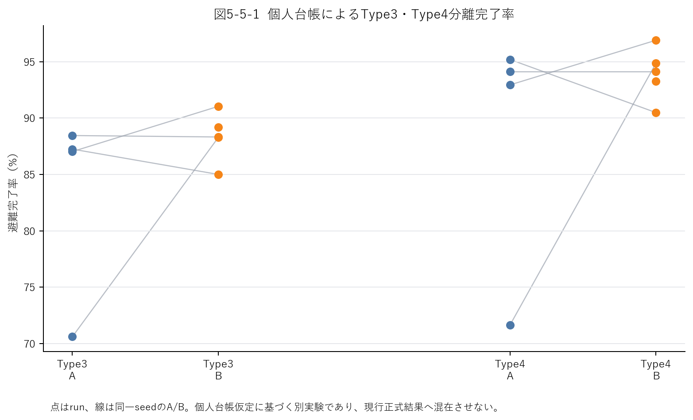

# Phase 3 Type3・Type4分離会計結果

> 実施日：2026/07/21  
> 位置づけ：現行Phase 3正本を変更しない追加診断  
> 対象：Type3（車を利用できない非高齢者）2,320人、Type4（車を利用できない高齢者）935人

## 1. 目的

従来はType3とType4を合算していたため、高齢者かつ自家用車を利用できないType4だけの避難結果を確認できなかった。本追加診断では、3,255人へ安定した個人IDを付与し、バスと救出走行への重複しない割当を作成して、Type3・Type4別の完了率と未到着人数を集計した。

## 2. 会計方法

1. `agent_types.csv`の出発地・種別・連番から、A/B共通の決定論的な`person_id`を生成した。
2. Scenario Bではバス旅客ログに対応する個人を先に予約し、同じ個人を救出走行へ割り当てない。
3. 残る個人をType3専用・Type4専用の救出車両へ割り当て、既存車両ログの到着状態を個人へ伝播した。
4. いずれの手段にも割り当てられない人は削除せず`unassigned`として分母へ残した。
5. 各runでID重複、手段重複、未知ID、人数保存、完了率0〜100%を検査した。

SUMOは車両を移動させるため、本処理は既存のSUMO車両・バスログへ個人台帳を決定論的に接続する後処理である。SUMO実行中に個人を明示的に動かした結果ではなく、同一世帯内の具体的な同乗関係も実測していない。

## 3. run構成

- Scenario A：既存3runにseed 7のfull runを追加し、計4run。
- Scenario B：既存5runを使用。
- 共通seed：1、7、42、23423の4組。
- seed 101のScenario Aは、強い渋滞により実時間約90分でシミュレーション時刻6,720秒にとどまったため停止し、正式集計へ含めなかった。

## 4. Type別完了率

| 種別 | A run数 | A中央値 | A最小〜最大 | B run数 | B中央値 | B最小〜最大 |
|---|---:|---:|---:|---:|---:|---:|
| Type3 | 4 | 87.13% | 70.60〜88.45% | 5 | 88.32% | 85.00〜91.03% |
| Type4 | 4 | 93.53% | 71.66〜95.19% | 5 | 94.12% | 90.48〜96.90% |
| Type3+4 | 4 | 89.12% | 70.91〜90.08% | 5 | 90.17% | 86.57〜92.72% |



## 5. 同一seedの対応差

差は「B完了率−A完了率」である。

| 種別 | 対応組数 | 差の中央値 | 最小〜最大 | 符号 | 方向一致 |
|---|---:|---:|---:|---:|---:|
| Type3 | 4 | +1.94pt | −2.24〜+17.67pt | 正2・負2 | なし |
| Type4 | 4 | +1.98pt | −4.71〜+23.21pt | 正2・負1・ゼロ1 | なし |
| Type3+4 | 4 | +1.95pt | −2.95〜+19.26pt | 正2・負2 | なし |

Type4ではseed 42で+23.21ポイント、seed 7で+3.96ポイントだった一方、seed 23423では−4.71ポイント、seed 1では0ポイントだった。したがって、Type4だけへ分けても、バス導入による改善方向は4組すべてで一致しなかった。

## 6. 結論と主張可能範囲

個人単位の排他的会計により、Type4高齢者の完了率・未到着人数をType3と分離して再計算できる状態になった。しかし、共通seed 4組のType4差は正・負・ゼロをすべて含むため、現時点でも「バスが高齢者の逃げ遅れを一貫して減らした」とは言えない。

この結果は「効果がない」ことの証明でもない。5組目が未完了であること、既存runへ後処理台帳を接続したこと、救出車両を種別専用と仮定したこと、純追加型バスを比較していないことから、追加診断として扱う。現行Phase 3の正式結論と正本8runは上書きしない。

## 7. 再現用成果物

| 成果物 | パス |
|---|---|
| 実装 | `04_プログラム/scripts/p3_person_ledger.py` |
| 単体テスト | `04_プログラム/tests/unit/test_person_ledger.py` |
| 入力run一覧（相対パス正本） | `06_研究結果/phase3/data/type34_split_run_inputs_4pairs.csv` |
| run別指標 | 同フォルダ`type34_split_replicate_metrics.csv` |
| 対応差 | 同フォルダ`type34_split_paired_differences.csv` |
| 集約値 | 同フォルダ`type34_split_summary.json` |
| 個人台帳 | 同フォルダ`runs/<run>/person_ledger.csv` |
| manifest | 同フォルダ`manifest.json` |

リポジトリ直下で次を実行すると、台帳・集計・図を再生成できる。

```powershell
04_プログラム/venv/Scripts/python.exe 04_プログラム/scripts/p3_person_ledger.py batch --replicates 06_研究結果/phase3/data/type34_split_run_inputs_4pairs.csv
```
